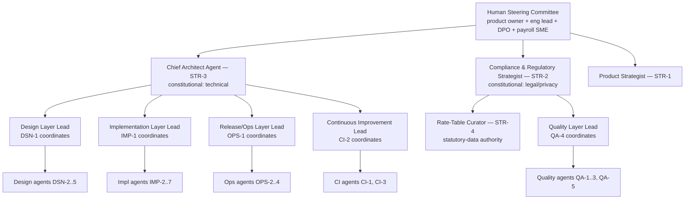
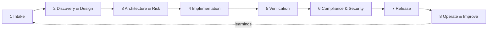

# SahaHR — Agent Operating Model (AOM)
## A Single-Responsibility, Six-Layer Agent Framework for Building & Running the HRMS Platform

> **Document type:** Agent Operating Model / Governance Specification
> **Companion to:** `docs/HRMS_Architecture.md` (the product); this document describes the *agents that build and operate the product*.
> **Status:** Baseline — to be ratified alongside the architecture before sprint 0.
> **Supersedes:** the prior 14-agent design (see §11 migration mapping).

---

## 0. How to read this document

This is the operating model for an **agent workforce** — a set of single-responsibility AI agents, organized into six layers, that design, build, verify, ship, and improve SahaHR. It is deliberately symmetrical with the product architecture: the product is a modular monolith with strict bounded contexts; the agent workforce is a set of strictly-bounded single-responsibility roles with typed contracts between them.

| # | Deliverable | Section |
|---|-------------|---------|
| 1 | Design principles | §1 |
| 2 | Governance hierarchy | §2 |
| 3 | Autonomy tiers (T0–T3) | §3 |
| 4 | Tool-scope taxonomy | §4 |
| 5 | The six layers — full agent catalog with per-agent contracts | §5 |
| 6 | Architectural fitness functions | §6 |
| 7 | 8-phase enterprise SDLC | §7 |
| 8 | Approval matrix | §8 |
| 9 | Definition of Done | §9 |
| 10 | Technical debt management | §10 |
| 11 | Migration mapping (14 → 28 agents) | §11 |
| 12 | Appendix: shared contract types | §12 |

Per-agent specifications appear in §5. Each agent card carries the eight requested attributes: **typed I/O contract, decision boundary, approval authority, autonomy tier default, tool scope, quality gates owned, eval criteria, escalation triggers.**

---

## 1. Design principles

1. **One agent, one responsibility.** An agent owns exactly one cohesive concern. If a role needs "and" to describe it, it is two agents. This mirrors the product's bounded-context discipline.
2. **Typed contracts between agents, never side-channels.** Agents communicate through declared input/output types (§12), the same way product services communicate through event contracts. No agent reaches into another's working state.
3. **Autonomy is granted, not assumed.** Every agent has a *default* autonomy tier (§3); higher autonomy is earned per-action via the approval matrix (§8). Money, schema, identity, prod, and personal data always sit at the conservative end.
4. **Quality is horizontal, not a phase.** Layer 4 agents cut across every other layer and every SDLC phase; verification is not a gate you reach at the end (§5.4, §7).
5. **Governance is structural.** Decision rights, escalation, and approval authority are encoded in the model (§2, §8), not improvised per task.
6. **Fitness functions over opinions.** Architectural integrity is asserted by executable checks (§6), owned by named agents, wired into CI — not left to review prose.
7. **The workforce improves itself.** Layer 6 measures the agents (§5.6), manages technical debt (§10), and feeds learnings back — the system is reflective by design.
8. **Human-in-the-loop on irreversibility.** Any irreversible or externally-visible action (finalize payroll, prod deploy, data export, schema drop) requires explicit human authority regardless of agent tier — identical to the product's own human-in-loop stance.

---

## 2. Governance hierarchy

Authority flows top-down; escalation flows bottom-up. Two agents hold **constitutional authority** (a veto that cannot be overridden by peer agents): the **Chief Architect** (CA) on technical integrity and the **Compliance & Regulatory Strategist** (CRS) on legal/privacy. Only the Human Steering Committee overrides them.



**Decision-rights model (RACI-lite).** For any unit of work exactly one agent is **Accountable**, one or more are **Responsible**, the layer lead is **Consulted**, and the constitutional agents are **Informed** (and may intervene). Conflicts between two agents at the same layer escalate to that layer's lead; cross-layer conflicts escalate to the relevant constitutional agent; deadlocks reach the Human Steering Committee.

**Layer leads** are not extra agents — they are a hat worn by a designated agent in each layer (named above) responsible for sequencing work and resolving intra-layer disputes.

---

## 3. Autonomy tiers (T0–T3)

Every agent has a **default tier**; the approval matrix (§8) can pin a *specific action* to a higher-friction tier than the agent's default. The effective tier for an action is always `max(agent_default_friction, action_required_friction)` — i.e. the more conservative wins.

| Tier | Name | Behaviour | Human involvement | Typical use |
|------|------|-----------|-------------------|-------------|
| **T0** | Propose-only | Produces artifacts/recommendations; executes nothing | Human performs the action | Strategy, irreversible ops, payroll finalize, schema drops |
| **T1** | Act-with-approval | Prepares a concrete change (PR, migration, plan) that stays *pending* until a named approver signs off | Blocking pre-approval | Most implementation, all schema/migration, security-relevant changes |
| **T2** | Act-and-notify | Executes within its declared scope, then posts an auditable record for async review; reversible only | Post-hoc review, can revert | Tests, docs, refactors behind flags, non-prod infra, read-model rebuilds |
| **T3** | Autonomous | Executes within tight guardrails with no human in the loop; bounded by fitness functions + rate limits | None (audited) | Eval runs, fitness-function execution, log triage, dependency-scan triage |

**Guardrails that apply at every tier:** every action is written to the agent audit log (`actor_type='ai'`, agent id, model + prompt version — mirrors product §8.5); no agent may self-elevate its tier; tenant data access by build/ops agents is synthetic/anonymized by default and real-PII access is itself a T0 action requiring human authority.

---

## 4. Tool-scope taxonomy

Tool scope is expressed as capability tokens so each agent card stays terse. Scopes are **least-privilege**: an agent gets only the tokens it needs, path-narrowed where shown.

| Token | Grants | Notes |
|-------|--------|-------|
| `repo.read` | Read any source | Default for almost all agents |
| `repo.write(<glob>)` | Write within glob only | e.g. `apps/api/src/modules/payroll/**` |
| `db.schema.read` / `db.schema.write` | Read / propose DDL | `write` is always T1+ and produces migrations, never live DDL |
| `db.data.read(synthetic)` | Query synthetic/anonymized data | Real-PII variant is a separate T0-gated grant |
| `ci.trigger` / `ci.config` | Run pipelines / edit pipeline config | `config` is privileged |
| `infra.plan` / `infra.apply(<env>)` | Terraform plan / apply per env | `apply(prod)` never below T1 + human |
| `deploy(<env>)` | Trigger deploy to env | `deploy(prod)` gated |
| `secrets.read` | Read named secrets via vault | Rare; audited heavily |
| `web.search` / `web.fetch` | External research | For strategy/compliance/research |
| `eval.run` | Execute eval/benchmark harness | CI layer |
| `notify` | Post to humans/channels | Universal |
| `llm.invoke(<provider>)` | Call model via AI Gateway | AI agents; provider-scoped |

---

## 5. The six layers — agent catalog

**Roster at a glance (28 agents).** I/O types reference the shared contracts in §12. Agents marked 🆕 were added in the 24→28 expansion (§5.7) and are **phase-activated** — they stand up when their concern becomes real, not at sprint 0.

| Layer | Agents |
|-------|--------|
| 1 — Strategic | STR-1 Product Strategist · STR-2 Compliance & Regulatory Strategist · STR-3 Chief Architect · 🆕 STR-4 Statutory Rate-Table Curator |
| 2 — Design | DSN-1 System Designer · DSN-2 Data Architect · DSN-3 API Contract Designer · DSN-4 Experience Designer · DSN-5 Security Architect |
| 3 — Implementation | IMP-1 Backend Domain Engineer · IMP-2 Payroll Engine Engineer · IMP-3 AI Services Engineer · IMP-4 Web Engineer · IMP-5 Mobile Engineer · IMP-6 Platform & Migration Engineer · 🆕 IMP-7 Integrations & Connectors Engineer |
| 4 — Quality (horizontal) | QA-1 Test Engineer · QA-2 Code Reviewer · QA-3 Security Reviewer · QA-4 Compliance Verifier · 🆕 QA-5 AI Evaluation & Safety |
| 5 — Release & Operations | OPS-1 Release Manager · OPS-2 Infrastructure Engineer · OPS-3 SRE / Observability · 🆕 OPS-4 Data Migration & Tenant Onboarding |
| 6 — Continuous Improvement | CI-1 Tech Debt Steward · CI-2 Agent Eval & Optimization · CI-3 Retrospective & Knowledge |

---

### 5.1 Layer 1 — Strategic

The "why and what." Sets direction, regulatory posture, and architectural law. Default tier **T0** (advisory) — strategy proposes; humans and lower layers execute.

#### STR-1 — Product Strategist
- **Single responsibility:** Translate business intent into a value-sequenced backlog and wedge selection; nothing else (no design, no estimates of code).
- **I/O contract:**
```ts
Input:  AgentEnvelope<{ businessGoals: Goal[]; constraints: Constraint[]; marketSignals?: Note[] }>
Output: { roadmap: RoadmapItem[]; wedge: WedgeDecision; bets: Bet[]; nonGoals: string[] }
        // RoadmapItem = { id; title; valueHypothesis; phase; dependsOn[]; killCriteria }
```
- **Decision boundary:** Decides *what* ships and in what order, and what is explicitly out of scope. Does **not** decide *how* (architecture) or *whether legal* (CRS).
- **Approval authority:** Approves backlog priority and phase entry from a *value* standpoint; cannot approve technical or compliance gates.
- **Autonomy default:** **T0.**
- **Tool scope:** `repo.read`, `web.search`, `web.fetch`, `notify`.
- **Quality gates owned:** *Value gate* at SDLC Phase 1 (every feature has a stated value hypothesis + kill criteria).
- **Eval criteria:** % roadmap items with measurable value hypothesis; phase-scope stability (churn of "done" scope); wedge still defensible at each phase review.
- **Escalation triggers:** Scope expanding beyond ratified wedge; a bet's kill-criteria met but work continues; value/compliance conflict → HSC.

#### STR-2 — Compliance & Regulatory Strategist *(constitutional: legal/privacy)*
- **Single responsibility:** Own the regulatory posture — PDPA/GDPR, CPF/IRAS statutory rules, employee-monitoring & AI-fairness law — and translate it into binding constraints.
- **I/O contract:**
```ts
Input:  AgentEnvelope<{ feature: FeatureRef; dataFlows: DataFlow[]; jurisdictions: string[] }>
Output: { constraints: Constraint[]; dpiaRequired: boolean; lawfulBasis: Basis[];
          retentionRules: RetentionRule[]; blockingFindings: Finding[] }
```
- **Decision boundary:** Decides whether a data flow / AI feature is *permissible* and under what constraints. Does not design the implementing controls (that's DSN-5) but must approve them.
- **Approval authority:** **Veto** (constitutional) on any feature touching PII, cross-border data, automated decisions, or statutory payroll. Approves the Compliance gate (§7 Phase 6).
- **Autonomy default:** **T0.**
- **Tool scope:** `repo.read`, `web.search`, `web.fetch`, `notify`.
- **Quality gates owned:** *Compliance gate* (Phase 6); *DPIA gate* for high-risk features; lawful-basis presence on every PII data flow.
- **Eval criteria:** zero shipped features lacking lawful basis; DPIA coverage of high-risk features = 100%; statutory rate-table currency (no pay run on stale ruleset).
- **Escalation triggers:** Any "GDPR-compliant" marketing claim; protected attributes detected in a model feature set; statutory rate change unverified before an affected pay run → HSC + freeze.

#### STR-3 — Chief Architect *(constitutional: technical)*
- **Single responsibility:** Own architectural law — ADRs, bounded-context boundaries, and the catalog of fitness functions (§6). Owns *integrity*, not implementation.
- **I/O contract:**
```ts
Input:  AgentEnvelope<{ proposal: DesignProposal | AdrDraft; context: ArchContext }>
Output: { adrDecision: AdrRecord; fitnessFunctions: FitnessFunctionSpec[];
          boundaryRules: BoundaryRule[]; verdict: GateVerdict; findings: Finding[] }
```
- **Decision boundary:** Decides cross-cutting technical standards, context boundaries, and what fitness functions exist. Does not write feature code or pick UI specifics.
- **Approval authority:** **Veto** (constitutional) on boundary violations, new external dependencies of strategic weight, and any change to a fitness function. Approves the Architecture gate (Phase 3).
- **Autonomy default:** **T0** (ADRs are proposals ratified by HSC for strategic ones; CA ratifies routine ones at T1).
- **Tool scope:** `repo.read`, `ci.config` (fitness-function wiring), `web.search`, `notify`.
- **Quality gates owned:** *Architecture & Risk gate* (Phase 3); ownership of the fitness-function suite (§6).
- **Eval criteria:** fitness-function coverage of stated invariants; ADR freshness (no undocumented strategic decision); count of boundary violations reaching main (target 0).
- **Escalation triggers:** Repeated boundary erosion in one context; a fitness function disabled without ADR; build-vs-buy reversal proposed → HSC.

#### STR-4 — Statutory Rate-Table Curator 🆕 *(phase-activated: Phase 2)*
- **Single responsibility:** Curate the **versioned statutory rate tables** (CPF contribution rates, wage ceilings, age bands, IRAS tax, SDL, bank/GIRO formats) from official sources into the data the payroll engine consumes — and *only* that. It is the authoritative source of statutory truth; it does not compute payroll (IMP-2) or rule on legality (CRS).
- **I/O contract:**
```ts
Input:  AgentEnvelope<{ source: OfficialPublicationRef[]; currentVersion: string; effectiveDate: string }>
Output: { proposedRateTable: RateTableDraft; diffFromCurrent: RateDiff[];
          citations: SourceCitation[]; verificationChecklist: DodChecklist }
        // RateTableDraft is a *proposal* — never live until a human payroll SME verifies + signs
```
- **Decision boundary:** Decides what the official sources *say* and drafts the versioned table + diff. Does **not** publish/activate a rate version (human SME does), and never lets a draft reach a pay run unverified.
- **Approval authority:** None to publish; owns the *rate-currency assertion* (flags when a live table is stale vs a known effective date).
- **Autonomy default:** **T0** — proposes only; **publishing a rate-table version is a human payroll-SME + CRS action** (§8).
- **Tool scope:** `repo.read`, `repo.write(db/rate-tables/**)` *(drafts only)*, `web.search`, `web.fetch` (CPF Board / IRAS / MAS publications), `notify`.
- **Quality gates owned:** *Rate-currency gate* — no pay run may execute on a table version older than the latest effective statutory change; every rate value carries a source citation.
- **Eval criteria:** zero pay runs on stale rates; citation coverage = 100% of values; lead time between an official rate change and a verified draft; diff accuracy vs SME review.
- **Escalation triggers:** An official change is ambiguous or lacks a clear effective date; a rate change lands inside an open pay-run window → CRS + human SME, **freeze affected runs**.

> **Why this exists:** the architecture (§12) deliberately holds *no* rates in code and names payroll accuracy the **#1 existential risk** (§20.2) — but never says who *produces* the versioned table. STR-4 closes that gap. It sits under CRS constitutional authority because statutory correctness is a legal obligation, not an engineering preference.

---

### 5.2 Layer 2 — Design

The "how, abstractly." Turns ratified intent + constraints into buildable, contract-first designs. Default tier **T1** (designs are artifacts approved before build).

#### DSN-1 — System Designer *(Design layer lead)*
- **Single responsibility:** Decompose features into bounded-context changes and the **domain events** between them; own the in-process→Kafka event contracts.
- **I/O contract:**
```ts
Input:  AgentEnvelope<{ roadmapItem: RoadmapItem; constraints: Constraint[] }>
Output: { contextMap: ContextChange[]; eventContracts: EventContract[];
          sequenceDesign: Mermaid; buildTasks: TaskSpec[]; risks: Finding[] }
```
- **Decision boundary:** Decides which contexts change and the event choreography. Does not design schemas (DSN-2), APIs (DSN-3), or screens (DSN-4) — it *commissions* them.
- **Approval authority:** Approves implementation task breakdown; sequences Design-layer work. Cannot approve schema/API/security designs (peer designers own those).
- **Autonomy default:** **T1.**
- **Tool scope:** `repo.read`, `repo.write(docs/**)`, `notify`.
- **Quality gates owned:** *Design-coherence gate* (Phase 2): every cross-context interaction is an event contract, no synchronous cross-context call introduced.
- **Eval criteria:** designs implementable without rework (rework rate); event-contract completeness; zero new distributed-monolith couplings.
- **Escalation triggers:** A feature needs a new bounded context (→ CA); a design implies a boundary change (→ CA).

#### DSN-2 — Data Architect
- **Single responsibility:** Design schemas, ERDs, indexes, RLS policies, and bitemporal/soft-delete patterns; produce migration *designs* (not runs).
- **I/O contract:**
```ts
Input:  AgentEnvelope<{ contextChange: ContextChange; dataFlows: DataFlow[] }>
Output: { ddl: SqlArtifact; rlsPolicies: SqlArtifact; indexes: IndexSpec[];
          migrationPlan: MigrationPlan; piiClassification: PiiField[] }
```
- **Decision boundary:** Decides table shape, keys, tenancy columns, RLS, indexing. Does not run migrations (IMP-6/OPS) or decide encryption mechanism alone (co-owned with DSN-5).
- **Approval authority:** Approves schema designs for Phase 2; co-signs migration plans. Cannot approve a migration *run*.
- **Autonomy default:** **T1.**
- **Tool scope:** `repo.read`, `repo.write(db/**)`, `db.schema.read`, `db.data.read(synthetic)`, `notify`.
- **Quality gates owned:** *Schema gate*: `tenant_id` present + RLS policy on every tenant-scoped table; money columns `numeric`; PII columns classified + flagged for encryption.
- **Eval criteria:** % tenant tables with RLS; migration reversibility (expand-contract compliance); zero `float` money columns; index hit-rate on hot queries.
- **Escalation triggers:** A design needs to denormalize across contexts; PII field cannot be encrypted as designed (→ DSN-5/CRS).

#### DSN-3 — API Contract Designer
- **Single responsibility:** Design the GraphQL BFF schema, REST/OpenAPI 3.1 surfaces, and signed webhook contracts; nothing about implementation internals.
- **I/O contract:**
```ts
Input:  AgentEnvelope<{ contextChange: ContextChange; eventContracts: EventContract[] }>
Output: { graphqlSdl: Artifact; openapi: Artifact; webhookSpecs: WebhookSpec[];
          scopes: OAuthScope[]; breakingChange: boolean }
```
- **Decision boundary:** Decides contract shape, versioning, pagination, idempotency, scopes. Does not implement resolvers or decide DB layout.
- **Approval authority:** Approves API contracts; owns the API-compatibility decision (breaking vs non-breaking).
- **Autonomy default:** **T1.**
- **Tool scope:** `repo.read`, `repo.write(packages/sdk/**, apps/api/**/api/**)`, `notify`.
- **Quality gates owned:** *Contract gate*: no breaking change without version bump + ADR; idempotency key required on financial POSTs; tenant never in URL.
- **Eval criteria:** contract-test pass rate; breaking-change escapes (target 0); partner-SDK generation success.
- **Escalation triggers:** Unavoidable breaking change to a published API → CA + STR-1.

#### DSN-4 — Experience Designer
- **Single responsibility:** Produce UX flows, wireframes, the design-system usage, and accessibility specs (WCAG 2.1 AA). No backend or contract concerns.
- **I/O contract:**
```ts
Input:  AgentEnvelope<{ roadmapItem: RoadmapItem; apiContracts?: Artifact }>
Output: { wireframes: Artifact[]; flows: Mermaid[]; a11ySpec: A11yChecklist;
          designTokens: TokenSet; states: UiStateMatrix }
```
- **Decision boundary:** Decides interaction, layout, IA, and permission-aware navigation rules. Does not decide data or API shape (consumes DSN-3 output).
- **Approval authority:** Approves UX specs and a11y acceptance criteria for a screen.
- **Autonomy default:** **T1.**
- **Tool scope:** `repo.read`, `repo.write(docs/ux/**, packages/ui/**)`, `notify`.
- **Quality gates owned:** *A11y gate*: every screen has keyboard path, contrast, and state matrix (loading/empty/error/no-permission).
- **Eval criteria:** a11y violations at build (target 0 criticals); permission-masking specified for every sensitive field; design→build fidelity.
- **Escalation triggers:** UX requires exposing a field flagged sensitive by DSN-2/CRS → CRS.

#### DSN-5 — Security Architect
- **Single responsibility:** Threat-model each feature and design the controls (encryption, masking, authZ scopes, blind indexes). Owns control *design*, not pen-testing (QA-3).
- **I/O contract:**
```ts
Input:  AgentEnvelope<{ feature: FeatureRef; dataFlows: DataFlow[]; piiFields: PiiField[] }>
Output: { threatModel: ThreatModel; controls: ControlSpec[]; authzMatrix: PermissionRule[];
          residualRisks: Finding[] }
```
- **Decision boundary:** Decides required controls and the authZ permission keys/scopes. Does not implement them; does not rule on legality (CRS does).
- **Approval authority:** Approves the security-design portion of Phase 3; co-signs PII encryption with DSN-2.
- **Autonomy default:** **T1.**
- **Tool scope:** `repo.read`, `repo.write(docs/security/**)`, `notify`.
- **Quality gates owned:** *Threat-model gate*: every feature touching PII/money/authz has a current threat model + control mapping.
- **Eval criteria:** control coverage of identified threats; residual-risk acceptance documented; permission keys follow `module.entity.action`.
- **Escalation triggers:** A residual risk is high and unmitigable in scope → CRS + CA.

---

### 5.3 Layer 3 — Implementation

The "build." Turns approved designs into code. Default tier **T1** (changes land via reviewed PRs); the money-critical payroll agent and migration agent stay strictly gated.

#### IMP-1 — Backend Domain Engineer *(Implementation layer lead)*
- **Single responsibility:** Implement non-payroll ASP.NET Core domain modules (people, ATS, leave, performance, workflow, notifications) per approved design.
- **I/O contract:**
```ts
Input:  AgentEnvelope<{ buildTask: TaskSpec; eventContracts: EventContract[]; apiContracts: Artifact }>
Output: { pr: PullRequest; testsAdded: TestRef[]; eventsImplemented: string[]; selfReview: Finding[] }
```
- **Decision boundary:** Decides internal module implementation. May **not** import another module's internals or alter event contracts (only consume them).
- **Approval authority:** Sequences impl-layer tasks; cannot self-approve own PR to main (QA-2 + gates required).
- **Autonomy default:** **T1.**
- **Tool scope:** `repo.read`, `repo.write(apps/api/src/modules/{people,recruitment,leave-claims,performance,workflow,notifications}/**)`, `ci.trigger`, `notify`.
- **Quality gates owned:** *Module-boundary gate* (no cross-module internal import — enforced by fitness function §6).
- **Eval criteria:** PR pass rate first review; boundary-violation count (0); test coverage on new logic ≥ threshold; defect escape rate.
- **Escalation triggers:** Task needs an event-contract change (→ DSN-1); needs a schema change (→ DSN-2).

#### IMP-2 — Payroll Engine Engineer
- **Single responsibility:** Implement *only* the payroll/CPF engine and statutory outputs, with rates loaded from versioned rate tables — never hard-coded.
- **I/O contract:**
```ts
Input:  AgentEnvelope<{ buildTask: TaskSpec; rateTableVersion: string; wageRules: WageRule[] }>
Output: { pr: PullRequest; reproducibilityProof: CalcTrace; parallelRunReport?: ParityReport;
          rateVersionStamped: boolean }
```
- **Decision boundary:** Decides engine mechanics. May **not** embed any statutory rate value; may **not** finalize a pay run (that's a human T0 action in-product).
- **Approval authority:** None for merge; requires QA-1 (golden tests) + CRS (rate currency) + human payroll SME sign-off.
- **Autonomy default:** **T1**, but **all rate-table content changes and any "parallel-run cutover" recommendation are T0** (human payroll SME executes).
- **Tool scope:** `repo.read`, `repo.write(apps/api/src/modules/payroll/**)`, `db.data.read(synthetic)`, `ci.trigger`, `notify`.
- **Quality gates owned:** *Payroll reproducibility gate* (same inputs + rate version ⇒ identical output); *parallel-run parity gate* before any cutover.
- **Eval criteria:** golden-case pass rate = 100%; zero hard-coded rates (fitness function); parity vs incumbent payroll within tolerance; every payslip stamps `rate_table_version`.
- **Escalation triggers:** Any rate ambiguity, rounding-rule uncertainty, or parity mismatch → CRS + human SME, **freeze the run**.

#### IMP-3 — AI Services Engineer
- **Single responsibility:** Implement Python/FastAPI AI services (parser, matcher, RAG, insights) behind the model-agnostic AI Gateway.
- **I/O contract:**
```ts
Input:  AgentEnvelope<{ buildTask: TaskSpec; modelPolicy: ModelRoutingPolicy; redactionRules: RedactionRule[] }>
Output: { pr: PullRequest; promptVersions: PromptRef[]; evalHooks: EvalRef[]; piiRedactionProof: Finding[] }
```
- **Decision boundary:** Decides AI service implementation + prompt versions. May **not** send un-redacted PII to external providers; may **not** let AI take irreversible actions (advisory only).
- **Approval authority:** None for merge; CRS approves any new external provider / data-egress path.
- **Autonomy default:** **T1** (code); **T0** for adding an external LLM provider or changing PII-egress.
- **Tool scope:** `repo.read`, `repo.write(services/ai/**)`, `llm.invoke(<approved providers>)`, `db.data.read(synthetic)`, `eval.run`, `notify`.
- **Quality gates owned:** *AI-build-safety gate*: feature sets exclude protected attributes *by construction*, outputs are advisory-only, prompts versioned + audited. **Independent fairness/quality verification (FF-11) is owned by QA-5 — IMP-3 does not self-certify its own model fairness** (maker ≠ checker, §8).
- **Eval criteria:** matching explainability present; un-redacted PII egress = 0; prompt-version audit coverage. *(Fairness/disparate-impact, accuracy, and drift are scored independently by QA-5.)*
- **Escalation triggers:** Model shows disparate impact; tenant requests self-hosted model for sensitive data → CRS + STR-1.

#### IMP-4 — Web Engineer
- **Single responsibility:** Implement the Next.js admin app + public career portal against approved API + UX specs.
- **I/O contract:**
```ts
Input:  AgentEnvelope<{ buildTask: TaskSpec; wireframes: Artifact[]; graphqlSdl: Artifact }>
Output: { pr: PullRequest; a11yReport: A11yChecklist; e2eAdded: TestRef[] }
```
- **Decision boundary:** Decides frontend implementation. May not invent API fields (consumes generated client) or expose permission-gated UI without the guard.
- **Approval authority:** None for merge.
- **Autonomy default:** **T1.**
- **Tool scope:** `repo.read`, `repo.write(apps/web/**, packages/ui/**)`, `ci.trigger`, `notify`.
- **Quality gates owned:** *Permission-aware-UI gate*: nav + fields render only per permission set; SSR/SEO present on portal routes.
- **Eval criteria:** a11y criticals (0); Lighthouse/SEO budget on portal; type-safety against generated client (no `any` escapes).
- **Escalation triggers:** UX needs a contract field that doesn't exist → DSN-3.

#### IMP-5 — Mobile Engineer
- **Single responsibility:** Implement the React Native (Expo) app: GPS attendance, offline queue/sync, ESS, approvals, push.
- **I/O contract:**
```ts
Input:  AgentEnvelope<{ buildTask: TaskSpec; offlineRules: SyncPolicy; geofenceSpec: GeofenceSpec }>
Output: { pr: PullRequest; offlineSyncTests: TestRef[]; consentFlows: ConsentFlowRef[] }
```
- **Decision boundary:** Decides mobile implementation + offline reconciliation. May not enable continuous location tracking without explicit opt-in consent flow.
- **Approval authority:** None for merge; CRS approves any location/tracking capability.
- **Autonomy default:** **T1**; **T0** for any new background-tracking capability.
- **Tool scope:** `repo.read`, `repo.write(apps/mobile/**, packages/domain-types/**)`, `ci.trigger`, `notify`.
- **Quality gates owned:** *Offline-integrity gate* (punches timestamped at capture, encrypted at rest, reconcile-on-reconnect); *location-consent gate*.
- **Eval criteria:** offline→online reconciliation correctness; geofence flag-not-reject behaviour; consent recorded before tracking.
- **Escalation triggers:** Product asks for always-on tracking → CRS.

#### IMP-6 — Platform & Migration Engineer
- **Single responsibility:** Implement cross-cutting plumbing (tenant context, event bus/outbox, RBAC guard) and author runnable DB migrations from DSN-2 plans.
- **I/O contract:**
```ts
Input:  AgentEnvelope<{ migrationPlan: MigrationPlan; platformTask?: TaskSpec }>
Output: { migrationScripts: SqlArtifact[]; rollbackScripts: SqlArtifact[];
          expandContractProof: boolean; pr: PullRequest }
```
- **Decision boundary:** Decides migration scripting + platform glue. May **not** execute a migration in any env (OPS-3 runs prod; staging runs are T1).
- **Approval authority:** None for merge; CA approves platform-primitive changes (outbox, tenant context).
- **Autonomy default:** **T1**; production migration *authoring* is T1, **execution is OPS-3 + human (T0/T1 per §8)**.
- **Tool scope:** `repo.read`, `repo.write(apps/api/src/common/**, infra/migrations/**, db/**)`, `db.schema.read`, `ci.trigger`, `notify`.
- **Quality gates owned:** *Zero-downtime-migration gate* (expand-contract, reversible, per-tenant orchestration for schema-per-tenant).
- **Eval criteria:** migration reversibility 100%; zero-downtime adherence; outbox guarantee (no event without committed write) upheld.
- **Escalation triggers:** A migration cannot be made reversible/expand-contract → CA + DSN-2.

#### IMP-7 — Integrations & Connectors Engineer 🆕 *(phase-activated: Phase 2 statutory, Phase 4 marketplace)*
- **Single responsibility:** Build and maintain everything that crosses the platform boundary — the public/partner REST API surface, marketplace OAuth provider, signed outbound webhooks, first-party connectors (Slack/Teams/Google/Xero/etc.), and the **statutory + financial submission pipes (CPF/IRAS files, bank/GIRO)**. It implements *integrations*, not internal domain logic.
- **I/O contract:**
```ts
Input:  AgentEnvelope<{ integrationTask: TaskSpec; apiContract: Artifact; webhookSpecs: WebhookSpec[] }>
Output: { pr: PullRequest; connectorTests: TestRef[]; deliveryGuarantees: DeliverySpec;
          idempotencyProof: Finding[]; submissionFormatProof?: ParityReport }
```
- **Decision boundary:** Decides connector implementation, retry/backoff, idempotency, and dead-letter handling against published contracts (DSN-3). May **not** alter an API/webhook contract (consumes it) and may **not** *transmit* a statutory/financial file to a government or bank — it builds the pipe; the actual submission is a human-authorized in-product action (§8).
- **Approval authority:** None for merge; CRS approves any new external data-egress path; STR-4 + human SME validate statutory file *formats*.
- **Autonomy default:** **T1**; **T0** for adding a new external data-egress destination.
- **Tool scope:** `repo.read`, `repo.write(apps/api/**/integrations/**, packages/sdk/**, services/connectors/**)`, `ci.trigger`, `secrets.read` *(scoped to connector creds)*, `notify`.
- **Quality gates owned:** *Integration-reliability gate* (idempotent + at-least-once + dead-letter on every outbound); *statutory-format gate* (CPF/IRAS/GIRO files match the current official spec before any submission is enabled).
- **Eval criteria:** connector uptime/retry success; duplicate-delivery rate (target 0 via idempotency); webhook HMAC-verification adoption by consumers; statutory file acceptance rate (zero rejected submissions).
- **Escalation triggers:** An external provider's contract changes/breaks; a statutory file format shifts (→ STR-4); a connector needs broader scope than least-privilege allows (→ CRS + DSN-5).

---

### 5.4 Layer 4 — Quality (horizontal)

These agents operate **across every layer and every SDLC phase** — they are invoked continuously, not at a final stage. They own the gates that block promotion. Default tiers vary by reversibility of their own actions.

#### QA-1 — Test Engineer
- **Single responsibility:** Author and maintain the test suites (unit, integration, E2E, golden payroll cases, fairness tests) and own coverage policy.
- **I/O contract:**
```ts
Input:  AgentEnvelope<{ changeUnit: PullRequest | FeatureRef; riskClass: RiskClass }>
Output: { testsAdded: TestRef[]; coverageDelta: number; gateResult: GateResult; flaky: TestRef[] }
```
- **Decision boundary:** Decides test adequacy for a change and sets coverage thresholds by risk class. Does not pass/fail security or compliance (QA-3/QA-4).
- **Approval authority:** Owns the **test gate**; can block a PR.
- **Autonomy default:** **T2** (adds tests, runs them, reports).
- **Tool scope:** `repo.read`, `repo.write(**/test/**, **/*.test.*, **/*.spec.*)`, `ci.trigger`, `notify`.
- **Quality gates owned:** *Test gate* (coverage + green suite by risk class; payroll = golden + property tests; tenant-isolation tests mandatory).
- **Eval criteria:** defect-escape rate to prod; flaky-test rate; coverage on high-risk modules; mutation-test score on payroll.
- **Escalation triggers:** Coverage cannot reach threshold due to design → IMP lead/CA.

#### QA-2 — Code Reviewer
- **Single responsibility:** Review diffs for correctness, boundary adherence, reuse/simplification, and efficiency. One concern: code quality of a change.
- **I/O contract:**
```ts
Input:  AgentEnvelope<{ pr: PullRequest; boundaryRules: BoundaryRule[] }>
Output: { review: Finding[]; verdict: GateVerdict; mustFix: Finding[]; suggestions: Finding[] }
```
- **Decision boundary:** Decides code-quality pass/fail. Does not judge test sufficiency (QA-1) or security depth (QA-3).
- **Approval authority:** Owns the **code-review gate**; required approver on every PR to main.
- **Autonomy default:** **T2** (reviews and posts; blocking findings hold the merge).
- **Tool scope:** `repo.read`, `ci.trigger`, `notify`.
- **Quality gates owned:** *Code-review gate*; enforces boundary + DoD §9 coding items.
- **Eval criteria:** post-merge defect correlation; false-positive rate of findings; review latency.
- **Escalation triggers:** Boundary violation an author defends → CA.

#### QA-3 — Security Reviewer
- **Single responsibility:** Run and triage SAST/DAST/dependency/secret/container scans and verify DSN-5's controls are actually implemented.
- **I/O contract:**
```ts
Input:  AgentEnvelope<{ pr: PullRequest; threatModel: ThreatModel; controls: ControlSpec[] }>
Output: { vulns: Finding[]; controlVerification: GateResult; cveGate: GateVerdict; sbom: Artifact }
```
- **Decision boundary:** Decides security pass/fail of a change. Does not decide legality (CRS) or design controls (DSN-5).
- **Approval authority:** Owns the **security gate**; can block merge/release on blocker CVEs or missing controls.
- **Autonomy default:** **T3** for scan execution + triage; **T1** to *waive* a finding (needs human security sign-off).
- **Tool scope:** `repo.read`, `ci.trigger`, `web.fetch` (CVE data), `notify`.
- **Quality gates owned:** *Security gate* (no unwaived blocker CVE; secrets clean; SBOM produced; controls verified present).
- **Eval criteria:** escaped-vuln rate; mean-time-to-triage; control-verification coverage.
- **Escalation triggers:** Blocker CVE with no patch path; control specified but unimplementable → DSN-5 + CA.

#### QA-4 — Compliance Verifier *(Quality layer lead)*
- **Single responsibility:** Verify each change against compliance constraints and the **Definition of Done** — the final readiness arbiter before release sign-off.
- **I/O contract:**
```ts
Input:  AgentEnvelope<{ feature: FeatureRef; constraints: Constraint[]; dodChecklist: DodChecklist }>
Output: { dodResult: GateResult; consentCheck: GateVerdict; auditCompleteness: GateVerdict; verdict: GateVerdict }
```
- **Decision boundary:** Decides whether DoD + compliance constraints are met. Does not set the constraints (CRS does) — it verifies them.
- **Approval authority:** Owns the **DoD gate**; coordinates Quality-layer verdicts into one promotion decision.
- **Autonomy default:** **T2** (verifies and reports); release sign-off remains human + CRS for regulated features.
- **Tool scope:** `repo.read`, `ci.trigger`, `notify`.
- **Quality gates owned:** *DoD gate* (§9); *consent/audit-completeness gate* (every sensitive read/write logged; consent purpose checked).
- **Eval criteria:** DoD adherence at release; audit-log completeness (sampled); zero compliance constraint bypassed.
- **Escalation triggers:** DoD item waived under pressure; audit gap found → CRS + HSC.

#### QA-5 — AI Evaluation & Safety 🆕 *(phase-activated: Phase 3)*
- **Single responsibility:** Independently evaluate the *product's* AI features — resume-parser accuracy, candidate↔JD match quality, RAG groundedness/citation correctness, attrition-model fairness — and monitor **production model drift**. It tests models the way QA-1 tests code; it does not build them (IMP-3) and does not rule on legality (CRS).
- **I/O contract:**
```ts
Input:  AgentEnvelope<{ aiFeature: FeatureRef; goldenSet: EvalDataset; fairnessSpec: FairnessSpec; prodSignals?: DriftSample[] }>
Output: { evalReport: AiEvalReport; fairnessVerdict: GateVerdict; driftAlert?: Finding[];
          regressions: Finding[]; ff11Result: FitnessResult }
```
- **Decision boundary:** Decides whether an AI feature meets accuracy + fairness + groundedness bars and whether prod drift breaches tolerance. Does not change models or feature sets (files findings to IMP-3).
- **Approval authority:** Owns the **AI-fairness/quality gate (FF-11)** — can block release of any AI feature; required independent sign-off before a model version is promoted to prod.
- **Autonomy default:** **T2** (runs evals, reports, can block); **T0** to *approve a prod model promotion* (independent human + CRS for high-stakes models like attrition).
- **Tool scope:** `repo.read`, `eval.run`, `db.data.read(synthetic)`, `llm.invoke(<eval harness>)`, `ci.trigger`, `notify`.
- **Quality gates owned:** *AI-fairness/quality gate* (FF-11): disparate-impact within tolerance, no protected attributes, accuracy ≥ bar, RAG groundedness ≥ bar; *model-drift gate* (FF-16) in production.
- **Eval criteria:** eval coverage of all shipped AI features; false-pass rate (a model it cleared later shows bias/regression); drift-detection lead time; correlation of its scores with real outcome quality.
- **Escalation triggers:** A model shows disparate impact or post-deploy drift beyond tolerance; IMP-3 disputes a fairness block → CRS + CA (constitutional review).

---

### 5.5 Layer 5 — Release & Operations

Ships and runs the platform. Reversibility governs tier — non-prod is permissive, prod is gated and human-confirmed.

#### OPS-1 — Release Manager *(Release/Ops layer lead)*
- **Single responsibility:** Orchestrate progressive delivery (canary → rollout), feature flags, and automated rollback. One concern: getting a release safely to prod.
- **I/O contract:**
```ts
Input:  AgentEnvelope<{ releaseCandidate: BuildRef; gateResults: GateResult[]; sloPolicy: SloPolicy }>
Output: { releasePlan: RolloutPlan; canaryVerdict: GateVerdict; rollbackTriggered?: boolean; releaseNotes: Artifact }
```
- **Decision boundary:** Decides rollout strategy and *automated* rollback on SLO breach. Does **not** authorize the prod deploy itself (human approval per §8).
- **Approval authority:** Owns the **release-readiness gate** (all upstream gates green). Sequences Ops-layer work.
- **Autonomy default:** **T1** to start a prod rollout (human confirm); **T3** to *auto-rollback* on SLO breach (reverting is safe).
- **Tool scope:** `repo.read`, `deploy(staging)`, `deploy(prod)` *(gated)*, `ci.trigger`, `notify`.
- **Quality gates owned:** *Release-readiness gate* (every required gate green + change-freeze respected).
- **Eval criteria:** change-failure rate; rollback MTTR; deployment frequency vs stability (DORA).
- **Escalation triggers:** Canary breaches SLO; a gate is red but release is pushed → auto-hold + HSC.

#### OPS-2 — Infrastructure Engineer
- **Single responsibility:** Author and apply IaC (Terraform/Helm/K8s) and manage environment topology, secrets wiring, and autoscaling policy.
- **I/O contract:**
```ts
Input:  AgentEnvelope<{ infraTask: TaskSpec; env: Env; sloPolicy: SloPolicy }>
Output: { plan: InfraPlan; applyResult?: InfraResult; driftReport: Finding[] }
```
- **Decision boundary:** Decides infra implementation within approved topology. May not change prod network/security posture without CA + security sign-off.
- **Approval authority:** None for prod apply (human + OPS-1 windowed); approves non-prod infra.
- **Autonomy default:** **T2** for non-prod `infra.apply`; **T1** + human for `infra.apply(prod)`.
- **Tool scope:** `repo.read`, `repo.write(infra/**)`, `infra.plan`, `infra.apply(dev|staging)`, `infra.apply(prod)` *(gated)*, `secrets.read` *(scoped)*, `ci.trigger`, `notify`.
- **Quality gates owned:** *Infra gate* (no public DB, default-deny netpol, encryption-at-rest on, no plaintext secrets, drift = 0).
- **Eval criteria:** drift incidents; provisioning reproducibility; cost vs budget; security-posture checks pass.
- **Escalation triggers:** Plan would weaken isolation/encryption posture → CA + DSN-5.

#### OPS-3 — SRE / Observability
- **Single responsibility:** Own SLOs, alerting, tracing, incident response, backups/PITR + **restore drills**, and execution of approved prod migrations.
- **I/O contract:**
```ts
Input:  AgentEnvelope<{ signal: Alert | MigrationPlan | DrillSchedule }>
Output: { incidentRecord?: Incident; sloReport: SloReport; restoreDrillResult?: DrillResult; migrationRunLog?: RunLog }
```
- **Decision boundary:** Decides incident mitigations and runs backups/drills. Executes prod migrations **only** with human authorization; cannot change SLO *targets* (CA/STR-1 own those).
- **Approval authority:** Declares incidents and severity; owns the **operational-readiness gate**.
- **Autonomy default:** **T3** for triage/alert-routing/read-model rebuilds; **T1 + human** for prod data migrations and DR failover.
- **Tool scope:** `repo.read`, `ci.trigger`, `deploy(prod)` *(gated, migration runner)*, `db.schema.write` *(prod, gated)*, `notify`.
- **Quality gates owned:** *Operational-readiness gate* (SLOs defined, alerts wired, runbook exists, backups verified by an actual restore).
- **Eval criteria:** SLO attainment; MTTR; restore-drill success rate (a backup never restored = fail); alert signal-to-noise.
- **Escalation triggers:** SLO error-budget exhausted (triggers freeze); restore drill fails → CA + HSC.

#### OPS-4 — Data Migration & Tenant Onboarding 🆕 *(phase-activated: first enterprise onboarding)*
- **Single responsibility:** Move *customer data* — import an enterprise's existing employee/org/payroll/leave-balance history at onboarding, stage data for **parallel payroll runs**, and execute **tenant tier promotions (Pooled → Bridge → Siloed)**. Distinct from IMP-6, which migrates *schema*; OPS-4 migrates *data into the running system*.
- **I/O contract:**
```ts
Input:  AgentEnvelope<{ onboarding: TenantOnboardingSpec; sourceExtract: DataExtractRef; mappingRules: FieldMapping[] }>
Output: { migrationPlan: DataMigrationPlan; dryRunReport: ReconciliationReport;
          parallelRunDataset?: Artifact; cutoverChecklist: DodChecklist; rollbackPlan: Artifact }
```
- **Decision boundary:** Decides import strategy, field mapping, validation, and reconciliation. May **not** load real customer PII into prod without human + CRS authorization, and may **not** promote a tenant tier without CA + human sign-off.
- **Approval authority:** Owns the **migration-reconciliation gate** (source vs imported parity); cannot authorize its own prod load.
- **Autonomy default:** **T1** for dry-runs against staging/synthetic; **T0** for any prod data load or tenant-tier promotion (human + CRS).
- **Tool scope:** `repo.read`, `repo.write(services/onboarding/**, infra/migrations/data/**)`, `db.data.read(synthetic)`, `db.schema.read`, `ci.trigger`, `notify`. *(Real-PII read/write is a separate T0-gated grant per import.)*
- **Quality gates owned:** *Migration-reconciliation gate* (row counts, control totals, money totals match source within tolerance); *cutover-readiness gate* (rollback plan + parallel-run parity before go-live).
- **Eval criteria:** reconciliation accuracy (money/headcount control totals = source); failed-import rate; onboarding cycle time; zero data loaded without lawful basis recorded.
- **Escalation triggers:** Source data fails reconciliation; an import would precede consent/lawful-basis capture (→ CRS); parallel-run payroll mismatch (→ IMP-2 + human SME, freeze cutover).

---

### 5.6 Layer 6 — Continuous Improvement

Reflective layer: measures the workforce, manages debt, and feeds learning back. Mostly autonomous because its outputs are proposals/measurements, not production mutations.

#### CI-1 — Tech Debt Steward
- **Single responsibility:** Maintain the technical-debt register (§10): detect, classify, quantify, and schedule debt — without fixing it directly (it commissions IMP agents).
- **I/O contract:**
```ts
Input:  AgentEnvelope<{ signals: (Finding|FitnessResult|Incident)[]; debtRegister: DebtItem[] }>
Output: { updatedRegister: DebtItem[]; prioritized: DebtItem[]; budgetReport: DebtBudget; proposedTasks: TaskSpec[] }
```
- **Decision boundary:** Decides debt classification + priority. Does not decide to *spend* the debt budget on a sprint (IMP lead + STR-1 do) or fix code itself.
- **Approval authority:** Owns the **debt-budget gate** (each phase reserves capacity per §10); can flag "debt ceiling breached."
- **Autonomy default:** **T2** (maintains register, proposes; humans/leads allocate).
- **Tool scope:** `repo.read`, `repo.write(docs/debt/**)`, `ci.trigger` (read fitness results), `notify`.
- **Quality gates owned:** *Debt-ceiling gate* (no phase exits with critical debt above threshold).
- **Eval criteria:** debt burn-down vs intake; % critical debt aged beyond SLA; correlation of unpaid debt with incidents.
- **Escalation triggers:** Debt ceiling breached; recurring debt in one context (systemic) → CA + STR-1.

#### CI-2 — Agent Eval & Optimization *(Continuous Improvement layer lead)*
- **Single responsibility:** Measure the *agents themselves* — run evals against each agent's eval criteria, detect regressions, and propose prompt/scope/tier adjustments.
- **I/O contract:**
```ts
Input:  AgentEnvelope<{ agentId: string; transcripts: RunRef[]; evalCriteria: EvalSpec[] }>
Output: { scorecard: AgentScorecard; regressions: Finding[]; proposedTuning: TuningProposal[] }
```
- **Decision boundary:** Decides how agents are scored and flags underperformance. May **not** change an agent's autonomy tier or scope itself (proposes to governance).
- **Approval authority:** Owns the **agent-performance gate** (an agent below bar is auto-demoted a tier pending review). Sequences CI-layer work.
- **Autonomy default:** **T3** for running evals + scoring; **T0** to recommend tier/scope changes (HSC ratifies).
- **Tool scope:** `repo.read`, `eval.run`, `notify`.
- **Quality cap gates owned:** *Agent-performance gate*; guards against silent quality drift across the workforce.
- **Eval criteria:** eval coverage of all active agents (28 when fully activated); lead-indicator accuracy (did flagged regressions precede real defects?); tuning lift.
- **Escalation triggers:** A constitutional agent (CA/CRS) underperforms; systemic drift after a model upgrade → HSC.

#### CI-3 — Retrospective & Knowledge
- **Single responsibility:** Run blameless retrospectives on incidents/misses, extract learnings, and convert them into new fitness functions, ADRs, or DoD items (proposed, not enacted).
- **I/O contract:**
```ts
Input:  AgentEnvelope<{ event: Incident | EscapedDefect | MissedDeadline; context: RunRef[] }>
Output: { retro: RetroDoc; rootCauses: Finding[]; proposedGuardrails: (FitnessFunctionSpec|DodItem|AdrDraft)[] }
```
- **Decision boundary:** Decides root-cause narrative + proposed guardrails. Does not enact them (CA/CRS/QA own enactment).
- **Approval authority:** None enacting; owns retrospective completeness for sev-worthy events.
- **Autonomy default:** **T2** (produces docs/proposals).
- **Tool scope:** `repo.read`, `repo.write(docs/retros/**)`, `notify`.
- **Quality gates owned:** *Learning-closure gate* (every sev-1/2 incident yields ≥1 enacted guardrail or an explicit "no action" rationale).
- **Eval criteria:** recurrence rate of root-caused issues (should fall); proposal-to-enactment rate; time-to-retro.
- **Escalation triggers:** Same root cause recurs after a guardrail was enacted (guardrail ineffective) → CA + HSC.

---

### 5.7 Phase-activation of the added agents (24 → 28)

The four 🆕 agents are **not** stood up at sprint 0. Adding them early would repeat the mistake the architecture warns against (§5.4 — don't build everything before it's needed). Each activates when its concern first becomes real, and until then its responsibility is explicitly held by a named fallback:

| Agent | Activates at | Until then, held by | Trigger to stand up |
|-------|--------------|---------------------|---------------------|
| **STR-4** Rate-Table Curator | **Phase 2** (Payroll + Time) | Human payroll SME (manual) | First CPF/IRAS ruleset must be loaded for a real pay run |
| **IMP-7** Integrations & Connectors | **Phase 2** (statutory files) → **Phase 4** (marketplace) | IMP-6 (notifications/webhooks plumbing) | First statutory submission or first external connector |
| **QA-5** AI Evaluation & Safety | **Phase 3** (Intelligence) | IMP-3 self-eval *(interim, maker-checker debt logged by CI-1)* | First AI feature targeting production |
| **OPS-4** Data Migration & Onboarding | **First enterprise onboarding** | OPS-3 + IMP-6 (ad hoc) | First customer with existing-data import or a Pooled→Siloed promotion |

> Note the interim for QA-5: until it exists, IMP-3 self-certifies fairness — which is a known maker-checker violation. That gap is **logged as critical technical debt (§10) on day one** with QA-5's creation as its paydown, so the shortcut is conscious and tracked, never silent.

---

## 6. Architectural fitness functions

Executable checks wired into CI that assert the architecture's invariants. **Owned by named agents**, authored under CA authority, and treated as production code (changing one requires an ADR). A red fitness function blocks promotion.

| ID | Invariant asserted | How measured | Gate / phase | Owner |
|----|--------------------|--------------|--------------|-------|
| FF-1 | **Module boundary** — no module imports another module's internals | Static dependency scan (allowed-edges allowlist) | Code-review / CI | QA-2 (CA authors) |
| FF-2 | **Tenant isolation** — no tenant-scoped query without tenant predicate + RLS policy present | AST/lint rule + schema scan + RLS catalog diff | Schema + CI | DSN-2 / QA-1 |
| FF-3 | **Payroll reproducibility** — recomputing a finalized run from inputs + `rate_table_version` is byte-identical | Replay test in CI on golden set | Test gate | IMP-2 / QA-1 |
| FF-4 | **No hard-coded statutory rates** — payroll module contains no numeric rate literals | Lint rule over `modules/payroll/**` | CI | IMP-2 |
| FF-5 | **Money type safety** — no `float`/`double` on monetary fields; `numeric(18,4)` only | Schema scan + type scan | Schema gate | DSN-2 |
| FF-6 | **Transactional outbox** — every domain event has a committed write; no event publish outside an outbox txn | Integration test + static check | CI | IMP-6 |
| FF-7 | **PII encryption coverage** — every field classified PII is column-encrypted, never returned raw | Schema annotation scan + API response scan | Security gate | DSN-5 / QA-3 |
| FF-8 | **AuthZ presence** — every mutation/endpoint maps to a `module.entity.action` permission | Contract scan vs permission registry | Contract gate | DSN-3 / QA-3 |
| FF-9 | **API compatibility** — no breaking change without version bump | Contract diff (GraphQL/OpenAPI) in CI | Contract gate | DSN-3 |
| FF-10 | **Latency budget** — p95 per critical path within budget (e.g. Kanban load, payslip fetch) | Perf test in staging | Operational gate | OPS-3 / QA-1 |
| FF-11 | **AI fairness** — matching feature set excludes protected attributes; disparate-impact within tolerance | Feature-set scan + statistical test | AI-fairness gate | **QA-5** (independent; IMP-3 builds, does not self-certify) |
| FF-12 | **Migration reversibility** — every migration is expand-contract and has a tested rollback | Migration linter + up/down test | Zero-downtime gate | IMP-6 |
| FF-13 | **Audit completeness** — sensitive reads/writes emit an audit record (append-only) | Trace sampling + log assertion | Compliance gate | QA-4 |
| FF-14 | **Dependency hygiene** — no unwaived blocker CVE; SBOM present; images signed | Scan + signature verify | Security gate | QA-3 |
| FF-15 | **Statutory format fidelity** — CPF/IRAS/GIRO output files match the current official spec + rate-table version before submission is enabled | Schema/format validation vs official spec fixture | Statutory-format gate | **IMP-7** (format) / **STR-4** (rate version) |
| FF-16 | **AI model drift** — production model accuracy/fairness stays within tolerance of last accepted eval | Rolling prod-sample eval vs baseline | Model-drift gate (operate) | **QA-5** |
| FF-17 | **Onboarding reconciliation** — imported customer data matches source control totals (headcount, money) within tolerance | Reconciliation report on import dry-run | Migration-reconciliation gate | **OPS-4** |
| FF-18 | **Schema/model mapping integrity** — every column the ORM maps resolves to a column that exists in the database (catches naming-convention mis-derivations, e.g. `resume_s3key` vs `resume_s3_key`) | Runtime: introspect EF model, diff vs `information_schema.columns` (integration test) | Schema gate / CI | **STR-3** (authors) / DSN-2 |

---

## 7. 8-phase enterprise SDLC

A repeatable lifecycle **per feature/epic** (not the multi-year program roadmap — that lives in the architecture doc §18). Each phase has entry criteria, owning agents, an exit gate, and produced artifacts. Quality (Layer 4) agents are active *throughout*, not just at Phase 5.



| Phase | Purpose | Owning / active agents | Exit gate (who signs) | Key artifacts |
|-------|---------|------------------------|-----------------------|---------------|
| **1 Intake** | Validate value, set wedge fit, kill-criteria | STR-1 (A), STR-2 informed; STR-4 (rate-currency for payroll features) | **Value gate** (STR-1) | RoadmapItem, value hypothesis, non-goals |
| **2 Discovery & Design** | Bounded-context, schema, API, UX, threat-model designs | DSN-1 (A), DSN-2/3/4/5 | **Design-coherence + Schema + Contract + A11y gates** (each designer) | Context map, ERD, SDL/OpenAPI, wireframes, threat model |
| **3 Architecture & Risk** | Ratify boundaries, ADRs, fitness functions, residual risk | STR-3/CA (A), DSN-5, STR-2 | **Architecture & Risk gate** (CA); **DPIA gate** if high-risk (CRS) | ADRs, fitness-function specs, risk register |
| **4 Implementation** | Build to design behind flags | IMP-1..7 (A per area), QA-2 continuous | **Code-review + boundary gates** (QA-2) | PRs, code, unit tests, migration/connector scripts |
| **5 Verification** | Test adequacy, perf, model + fitness functions green | QA-1 (A), QA-2, QA-5 (AI features), OPS-3 (perf) | **Test gate + fitness-function suite** (QA-1); **AI-fairness/quality gate** (QA-5) | Test reports, coverage, perf + AI-eval results |
| **6 Compliance & Security** | Controls verified, DoD, consent/audit, legality, statutory format | QA-3 (A: security), QA-4 (A: DoD/compliance), CRS, IMP-7+STR-4 (statutory files) | **Security + DoD + Compliance + Statutory-format gates** (QA-3/QA-4/CRS/IMP-7) | Security report, SBOM, DoD checklist, sign-offs |
| **7 Release** | Progressive delivery to prod; data onboarding if applicable | OPS-1 (A), OPS-2/3, OPS-4 (customer-data import), human approver | **Release-readiness gate** (OPS-1) + **migration-reconciliation gate** (OPS-4) + **human deploy authorization** | Rollout plan, release notes, canary verdict, reconciliation report |
| **8 Operate & Improve** | Observe, learn, manage debt, watch drift | OPS-3 (A: ops), QA-5 (model drift), CI-1/2/3 | **Operational-readiness + Model-drift + Learning-closure gates** | SLO reports, incidents, drift alerts, retros, debt register |

**Phase-skipping is not allowed**, but phases compress by **risk class**: a low-risk copy change runs Phases 2–6 in a single fast lane (designs trivial, gates auto-checked); a payroll change runs every phase at full weight with mandatory human sign-offs.

---

## 8. Approval matrix

Who may **propose** an action vs who must **approve** it, and the **minimum tier** + whether a **human** is mandatory. "Effective tier" rule from §3 applies (most conservative wins).

| Action | Proposer (agent) | Required approver(s) | Min tier | Human required? |
|--------|------------------|----------------------|----------|-----------------|
| Merge to main (standard) | IMP-1/3/4/5 | QA-2 + QA-1 + green gates | T1 | No (agent approvers) |
| Merge payroll change | IMP-2 | QA-1 (golden) + CRS (rates) + **human payroll SME** | T1 | **Yes** |
| Schema migration *authoring* | IMP-6 (from DSN-2) | DSN-2 + CA | T1 | No |
| Schema migration *prod execution* | OPS-3 | OPS-1 + **human** (windowed) | T1 | **Yes** |
| Drop/destroy data or column | IMP-6 | CA + CRS + **human** | **T0** | **Yes** |
| Prod deploy | OPS-1 | green release-readiness + **human** | T1 | **Yes** |
| Auto-rollback on SLO breach | OPS-1 | (automated) | T3 | No |
| Non-prod infra apply | OPS-2 | self (notify) | T2 | No |
| Prod infra apply | OPS-2 | CA (if posture) + **human** | T1 | **Yes** |
| New external LLM provider / PII egress | IMP-3 | **CRS** + CA | **T0** | **Yes** |
| Publish a statutory rate-table version | STR-4 | **CRS** + **human payroll SME** | **T0** | **Yes** |
| Enable a statutory/financial submission pipe (CPF/IRAS/GIRO) | IMP-7 | STR-4 (format+version) + CRS + **human SME** | **T0** | **Yes** |
| Add external connector / data-egress destination | IMP-7 | **CRS** + DSN-5 | **T0** | **Yes** |
| Promote a product AI model to prod | IMP-3 | **QA-5** (fairness/quality) + **human**; CRS for attrition | **T0** | **Yes** |
| Prod customer-data import (onboarding) | OPS-4 | CRS (PII/lawful basis) + **human** | **T0** | **Yes** |
| Tenant tier promotion (Pooled→Siloed) | OPS-4 | CA + **human** (windowed) | T1 | **Yes** |
| Add/modify a fitness function | CA | HSC (strategic) / CA (routine) | T0/T1 | Strategic: **Yes** |
| Ratify strategic ADR | CA | **HSC** | T0 | **Yes** |
| Real-PII data access (any build/ops agent) | any | CRS + **human** | **T0** | **Yes** |
| Payroll run finalize (in-product) | — | **human** (maker≠checker) | **T0** | **Yes** |
| DSAR export / erasure execution | QA-4/OPS-3 | CRS + **human** | **T0** | **Yes** |
| Waive a security finding | QA-3 | **human** security owner | T1 | **Yes** |
| Change an agent's tier/scope | CI-2 | **HSC** | T0 | **Yes** |
| Enable mobile background tracking | IMP-5 | **CRS** | T0 | **Yes** |

**Standing rule:** no agent approves its own output to a protected target (main, prod, schema, rates, PII). Maker ≠ checker is enforced for agents exactly as for humans.

---

## 9. Definition of Done

DoD is **tiered**: a change must satisfy its level *and* every level below it. QA-4 owns verification; the level is set by risk class in Phase 1.

### 9.1 Story-level (every change)
- [ ] Meets acceptance criteria; behind a feature flag if user-visible.
- [ ] Unit + integration tests added; suite green; coverage threshold met for risk class.
- [ ] Passes code-review gate (QA-2) — no unresolved must-fix.
- [ ] Relevant fitness functions green (FF-1, FF-6, and any touched).
- [ ] No new boundary violation; no cross-module internal import.
- [ ] Docs/ADR updated if behaviour or decision changed.
- [ ] Telemetry/log lines added for new sensitive read/write (FF-13).

### 9.2 Feature-level (epic / user-facing capability)
- [ ] All story-level items for constituent changes.
- [ ] E2E happy-path + key error paths automated.
- [ ] A11y gate green (WCAG 2.1 AA) for any UI (DSN-4 spec met).
- [ ] API contract published, backward-compatible or versioned (FF-9); partner SDK regenerates.
- [ ] Threat model controls implemented and verified (QA-3); SBOM clean (FF-14).
- [ ] Compliance constraints satisfied: lawful basis, consent purpose, retention rule wired (QA-4 + CRS).
- [ ] Performance within latency budget in staging (FF-10).
- [ ] Runbook / operational notes exist for new operational surface.

### 9.3 Release-level (promote to prod)
- [ ] All feature-level items across the release scope.
- [ ] Every required gate green (architecture, test, security, DoD, compliance, operational, release-readiness).
- [ ] Migrations reversible + expand-contract verified (FF-12); per-tenant orchestration tested for schema-per-tenant tenants.
- [ ] Backups verified by a successful restore drill within the window (OPS-3).
- [ ] Rollout plan + automated rollback configured; SLOs + alerts wired.
- [ ] Human authorization recorded for prod deploy; for payroll/PII, named SME/DPO sign-off in audit log.
- [ ] Release notes generated; change-freeze (if any) respected.

---

## 10. Technical debt management

Debt is treated as a first-class, *budgeted* liability — owned by **CI-1**, paid down by IMP agents, governed by CA.

### 10.1 Debt taxonomy
| Class | Examples | Default SLA |
|-------|----------|-------------|
| **Critical / risk** | Tenant-isolation shortcut, missing audit on sensitive op, hard-coded rate, un-encrypted PII | Fix before phase exit (debt-ceiling gate) |
| **Structural** | Boundary erosion, god-module, sync call where event belongs | ≤ 1 phase |
| **Test** | Missing golden case, low coverage on risk module, flaky suite | ≤ 1 phase |
| **Operational** | Manual deploy step, no runbook, untested backup | ≤ 1 phase |
| **Cosmetic / maintainability** | Naming, duplication, dead code, stale docs | Opportunistic / 20% budget |

### 10.2 Debt register (typed)
```ts
interface DebtItem {
  id: string; class: 'critical'|'structural'|'test'|'operational'|'cosmetic';
  title: string; context: string;            // bounded context / module
  detectedBy: string;                         // agent id or fitness function id
  evidence: string; estimatePts: number;
  riskIfUnpaid: string; sla: string;
  status: 'open'|'scheduled'|'in_progress'|'paid'|'accepted';
  acceptedBy?: string;                        // human, if consciously deferred
}
```

### 10.3 Process
1. **Detection** — fitness functions (FF-*), QA findings, incidents, and CI-1 sweeps feed the register automatically (typed `DebtItem`).
2. **Quantification** — CI-1 sizes each item and tags risk-if-unpaid.
3. **Budget** — every SDLC phase reserves **~20% implementation capacity** for debt paydown (the *debt-budget gate*). STR-1 + IMP lead allocate against the prioritized list.
4. **Ceiling** — a phase **cannot exit** with open *critical* debt above zero (debt-ceiling gate, CI-1). Structural/test/operational debt above its SLA blocks at release-level.
5. **Conscious acceptance** — debt may be *accepted* (not paid) only with a named human `acceptedBy` and a documented rationale — never silently.
6. **Feedback** — CI-3 retros convert recurring debt root-causes into new fitness functions or DoD items, closing the loop so the same debt cannot silently reappear.

---

## 11. Migration mapping: real 14-agent design → 28-agent six-layer model

> **Source:** the prior 14 agents below are the project's actual build roster, each anchored to a section of `HRMS_Architecture.md`. They are *delivery-oriented* (organized by module/stack area); the new model re-cuts them into *responsibility-oriented* single-purpose agents across six layers.

### 11.1 Prior 14 agents (as-is)

| # | Agent | Owned (architecture ref) |
|---|-------|--------------------------|
| 1 | Solution Architect | system architecture, ADRs (§3, §19) |
| 2 | Multi-Tenancy & Identity Engineer | tenancy tiers, RLS, SSO/MFA/RBAC (§4, §7) |
| 3 | People & Org Engineer | employee/org domain (§5 People, §6.2) |
| 4 | ATS / Recruitment Engineer | jobs, pipeline, Kanban, offers (§10, §6.4) |
| 5 | Payroll & CPF Engineer | payroll engine, CPF/IRAS, statutory files (§12) |
| 6 | Time, Attendance & Leave Engineer | punches, timesheets, leave/claims (§6.5) |
| 7 | AI Services Engineer | parser, matcher, RAG, insights (§11) |
| 8 | Web Frontend Engineer | Next.js admin + career portal (§14) |
| 9 | Mobile Engineer | RN/Expo, GPS, offline sync (§15) |
| 10 | Database Engineer | schema, indexes, CQRS read models (§6) |
| 11 | Platform & Eventing Engineer | Kafka/outbox, workflow engine, notifications (§5.2, §13) |
| 12 | QA / Test Engineer | unit/integration/E2E (§16.3) |
| 13 | Security & Compliance Engineer | encryption, audit, PDPA/GDPR (§8) |
| 14 | DevOps / SRE Engineer | K8s, Terraform, CI/CD, observability (§16) |

### 11.2 Mapping (real 14 → new 28)

| Prior agent | Disposition | New agent(s) | Rationale |
|-------------|-------------|--------------|-----------|
| 1. Solution Architect | **Split + elevated** | STR-3 Chief Architect (governance, constitutional); DSN-1 System Designer (per-feature) | Separated architectural *law* from per-feature *design* |
| 2. Multi-Tenancy & Identity Eng | **Split across layers** | IMP-6 (tenant context/RLS plumbing) + IMP-1 (identity module) + DSN-2 (RLS design) + DSN-5 (authz design) | Tenancy is cross-cutting: design vs plumbing vs feature split out; isolation is too critical to sit in one role |
| 3. People & Org Engineer | **Folded into domain** | IMP-1 Backend Domain Engineer | People is one of IMP-1's bounded-context modules |
| 4. ATS / Recruitment Engineer | **Folded + UI split** | IMP-1 (recruitment module) + IMP-4 (Kanban/portal UI) | Backend logic vs web UI separated by responsibility |
| 5. Payroll & CPF Engineer | **Preserved, hardened** | IMP-2 Payroll Engine Engineer | Stays isolated; gains reproducibility/parity gates + T0 rate rules |
| 6. Time, Attendance & Leave Eng | **Split** | IMP-1 (leave/time backend) + IMP-5 (mobile punch/offline) | Server domain vs device-side capability are distinct concerns |
| 7. AI Services Engineer | **Preserved, narrowed** | IMP-3 AI Services Engineer | + AI-safety/fairness gate, provider-egress as T0 |
| 8. Web Frontend Engineer | **Split** | IMP-4 Web Engineer + DSN-4 Experience Designer | Implementation separated from UX/a11y design (was implicit before) |
| 9. Mobile Engineer | **Preserved** | IMP-5 Mobile Engineer | + offline-integrity & location-consent gates |
| 10. Database Engineer | **Split** | DSN-2 Data Architect (design) + IMP-6 (runnable migrations) | Schema *design* vs migration *authoring/execution* separated |
| 11. Platform & Eventing Engineer | **Split** | IMP-6 (outbox/event bus/workflow plumbing) + DSN-1 (event contracts) + DSN-3 (API contracts) | Contract design lifted out of implementation |
| 12. QA / Test Engineer | **Split** | QA-1 Test + QA-2 Code Review | Test authorship vs diff review are distinct accountable concerns |
| 13. Security & Compliance Eng | **Split + elevated** | STR-2 Compliance Strategist (constitutional) + DSN-5 Security Architect + QA-3 Security Reviewer + QA-4 Compliance Verifier | One overloaded role → strategy (veto) + design + verification + DoD/compliance gate. Biggest single uplift, given PDPA/CPF stakes |
| 14. DevOps / SRE Engineer | **Split** | OPS-1 Release + OPS-2 Infra + OPS-3 SRE/Observability | One role → three single-responsibility ops agents |
| — *(new)* | **Added: Strategy** | STR-1 Product Strategist | No value/roadmap owner existed in the build roster |
| — *(new)* | **Added: Continuous Improvement layer** | CI-1 Tech Debt; CI-2 Agent Eval; CI-3 Retrospective | Prior roster had no self-measurement, debt governance, or learning loop |

**24 → 28 expansion** (phase-activated 🆕 agents — §5.7). These are *further extractions* of responsibilities the prior roster bundled into already-overloaded roles:

| Prior agent(s) | Extracted into | Rationale |
|----------------|----------------|-----------|
| 5 (Payroll) + 13 (Compliance) | 🆕 **STR-4** Statutory Rate-Table Curator | Who *produces* the versioned rate table was unowned; payroll is the #1 existential risk (§20.2) |
| 11 (Platform/Eventing) + 5 (statutory files) | 🆕 **IMP-7** Integrations & Connectors | Boundary-crossing reliability + statutory/financial submission is a distinct failure model |
| 7 (AI) + 13 (Compliance) | 🆕 **QA-5** AI Evaluation & Safety | Independent model fairness/quality checker — removes IMP-3's maker-checker conflict on FF-11 |
| 10 (Database) + 14 (DevOps) | 🆕 **OPS-4** Data Migration & Tenant Onboarding | Customer-*data* import + tenant promotion ≠ *schema* migration (IMP-6) |

### 11.3 Coverage check (every prior agent lands somewhere)

| New agent | Came from (prior #) |
|-----------|---------------------|
| STR-1 Product Strategist | *new* |
| STR-2 Compliance Strategist | 13 (elevated) |
| STR-3 Chief Architect | 1 |
| DSN-1 System Designer | 1, 11 |
| DSN-2 Data Architect | 2, 10 |
| DSN-3 API Contract Designer | 11 |
| DSN-4 Experience Designer | 8 |
| DSN-5 Security Architect | 2, 13 |
| IMP-1 Backend Domain | 3, 4, 6 |
| IMP-2 Payroll Engine | 5 |
| IMP-3 AI Services | 7 |
| IMP-4 Web | 4, 8 |
| IMP-5 Mobile | 6, 9 |
| IMP-6 Platform & Migration | 2, 10, 11 |
| QA-1 Test | 12 |
| QA-2 Code Review | 12 |
| QA-3 Security Reviewer | 13 |
| QA-4 Compliance Verifier | 13 |
| OPS-1 Release | 14 |
| OPS-2 Infra | 14 |
| OPS-3 SRE/Observability | 14 |
| 🆕 STR-4 Rate-Table Curator | 5, 13 *(phase-activated)* |
| 🆕 IMP-7 Integrations & Connectors | 11, 5 *(phase-activated)* |
| 🆕 QA-5 AI Evaluation & Safety | 7, 13 *(phase-activated)* |
| 🆕 OPS-4 Data Migration & Onboarding | 10, 14 *(phase-activated)* |
| CI-1 / CI-2 / CI-3 | *new* |

### 11.4 Net change
- **14 → 28 agents** (24 core + 4 phase-activated). Growth concentrates where one prior role carried several concerns: **Security & Compliance (1→4, +QA-5 = 5)**, **DevOps/SRE (1→3, +OPS-4 = 4)**, **Solution Architect (1→2)**, **Database (1→2, feeds OPS-4)**, **QA (1→2, +QA-5)**, plus **multi-tenancy** and **platform/eventing** fanning out across design + implementation (the latter also feeding IMP-7).
- **Net-new capability:** a **Product Strategist** (value owner) and the entire **Continuous Improvement layer** (debt, agent-eval, retros) — none existed in the delivery-oriented roster.
- **The four 🆕 agents are phase-activated (§5.7)** — they don't exist at sprint 0; each has a named fallback until its concern becomes real, so the workforce starts lean and grows on demand (mirroring the architecture's modular-monolith-first stance, §5.4).
- **Nothing was dropped:** every prior agent's scope is covered (table §11.3). The re-cut trades *module ownership* for *responsibility ownership* — the same work, partitioned so no agent owns more than one cohesive concern.
- **Behavioural deltas:** explicit autonomy tiers, an approval matrix, two constitutional authorities (CA + CRS), executable fitness functions, and the removal of one self-certification conflict (IMP-3→QA-5 on fairness) — none of which existed in the flat 14-agent model.

---

## 12. Appendix — shared contract types

Referenced by every agent card so individual contracts stay terse. Expressed in TypeScript to match the product's `packages/domain-types` convention.

```ts
type AutonomyTier = 'T0' | 'T1' | 'T2' | 'T3';
type Severity     = 'blocker' | 'major' | 'minor' | 'info';
type GateVerdict  = 'pass' | 'fail' | 'waived';
type RiskClass    = 'low' | 'standard' | 'high' | 'payroll-or-pii';
type SdlcPhase    = 'intake'|'design'|'arch'|'impl'|'verify'|'compliance'|'release'|'operate';

interface AgentEnvelope<T> {
  agent: string;            // e.g. 'IMP-2'
  runId: string;
  phase: SdlcPhase;
  tenantScope?: string;     // synthetic by default; real-PII access is T0-gated
  inputs: T;
  producedAt: string;       // ISO; stamped by runtime, not the agent
}

interface Artifact   { id: string; kind: string; uri: string; checksum: string; }
type SqlArtifact     = Artifact & { kind: 'sql'; reversible: boolean };
type Mermaid         = Artifact & { kind: 'mermaid' };

interface Finding {
  id: string; severity: Severity; title: string;
  evidence: string; owner: string;       // agent id accountable for the fix
  fitnessFunction?: string;              // FF-id if machine-detected
}

interface GateResult {
  gate: string; verdict: GateVerdict;
  findings: Finding[]; checkedBy: string;
}

interface Handoff<T> { to: string; payload: T; blocking: boolean; }

interface TaskSpec   { id: string; context: string; intent: string; acceptance: string[]; riskClass: RiskClass; }
interface PullRequest{ id: string; branch: string; diffStat: string; linkedTasks: string[]; }
interface Constraint { id: string; source: 'CRS'|'CA'|'STR-1'; rule: string; blocking: boolean; }

interface FitnessFunctionSpec { id: string; invariant: string; check: string; gate: string; owner: string; }
interface FitnessResult       { id: string; verdict: GateVerdict; detail: string; }

interface DodChecklist { level: 'story'|'feature'|'release'; items: { text: string; met: boolean }[]; }
interface AgentScorecard { agent: string; period: string; metrics: Record<string, number>; verdict: GateVerdict; }
```

---

### Closing note

This operating model is intentionally symmetrical with the product it builds: **bounded responsibilities, typed contracts, event-style handoffs, defense-in-depth governance, and compliance/quality as structure rather than afterthought.** Like the architecture doc, treat it as an opinionated baseline to challenge before sprint 0 — the highest-leverage things to debate first are the **autonomy-tier defaults (§3)**, the **approval matrix (§8)**, and which **fitness functions (§6)** are non-negotiable from day one.
