# SahaHR — Enterprise All-in-One HRMS Platform
## System Architecture & Engineering Blueprint

> **Document type:** Solution Architecture Document (SAD)
> **Scope:** Greenfield, cloud-native, multi-tenant SaaS HRMS + ATS + Payroll + Workforce + Employee Experience + AI
> **Target markets:** Enterprises, staffing agencies, SMEs, multi-company groups (Singapore-first, multi-country ready)
> **Status:** Architecture baseline — to be ratified before sprint 0

---

## 0. How to read this document

This document delivers all 17 requested artifacts. Each maps to a numbered section:

| # | Deliverable | Section |
|---|-------------|---------|
| 1 | Full system architecture | §3 |
| 2 | Database schema | §6 |
| 3 | Multi-tenant architecture | §4 |
| 4 | UI/UX wireframes | §14 |
| 5 | API specifications | §9 |
| 6 | Microservices breakdown | §5 |
| 7 | Folder structure | §17 |
| 8 | Authentication flow | §7 |
| 9 | Payroll engine logic | §12 |
| 10 | ATS workflow design | §10 |
| 11 | AI architecture | §11 |
| 12 | Security architecture | §8 |
| 13 | DevOps deployment strategy | §16 |
| 14 | Enterprise dashboard design | §14.4 |
| 15 | Mobile app architecture | §15 |
| 16 | Scalable SaaS infrastructure | §16 |
| 17 | Development roadmap | §18 |

A note on naming: the product is referred to here as **SahaHR** as a working name.

---

## 1. Product vision & positioning

SahaHR unifies the full employee lifecycle — **hire → pay → manage → grow → offboard** — on a single multi-tenant platform with AI woven through every module rather than bolted on.

The positioning target blends:

- **Oracle HCM / Workday** — depth of HR data model and enterprise scalability.
- **SAP SuccessFactors** — configurable enterprise workflows and approvals.
- **Greenhouse / Ashby** — best-in-class ATS pipeline UX.
- **Rippling** — modern, fast, integrated admin experience.

The deliberate architectural bet: **a shared domain core (employees, org, identity, money) with module-specific bounded contexts on top**, so we get Workday-grade data integrity without Workday-grade UX friction.

### 1.1 Design tenets

1. **Multi-tenant by default, isolatable on demand** — pooled infrastructure, with a path to dedicated schemas/clusters for enterprise tenants who require it.
2. **Domain-driven, modular monolith → selective microservices** — we do *not* start with 19 microservices (that is an operational trap for an early platform). We start with a well-bounded modular monolith and extract services only where scaling, isolation, or team boundaries demand it (§5.4).
3. **Event-driven backbone** — every state change emits a domain event; this powers automation, audit, analytics, and notifications without point-to-point coupling.
4. **Config over code** — payroll rates, leave policies, approval chains, hiring stages, and RBAC are all *data*, not deployments. A tenant admin changes behavior without an engineering release.
5. **Compliance is structural, not a feature** — PDPA/GDPR consent, encryption, residency, and audit are enforced at the data-access layer, not sprinkled per-module.
6. **AI as an assist, with a human in the loop** — AI ranks, drafts, summarizes, and suggests. It never auto-rejects a candidate, auto-approves a payroll run, or makes an irreversible decision unattended.

---

## 2. Technology stack & rationale

| Layer | Choice | Why |
|-------|--------|-----|
| **Frontend (web)** | Next.js 14+ (App Router), React, TypeScript | SSR/ISR for the public career portal (SEO), client components for the rich admin app. One codebase, two delivery modes. |
| **UI system** | Tailwind CSS + shadcn/ui + Radix primitives | Accessible-by-default, enterprise-neutral aesthetic, fully themeable per tenant. |
| **Charts/anim** | Recharts + Framer Motion | Requested; mature, lightweight. |
| **Mobile** | React Native (Expo) | Shared TS domain logic with web; native GPS/camera/biometric APIs for attendance. |
| **API edge** | GraphQL (BFF for the app) + REST (public/integration API) | GraphQL avoids over-fetching in dense HR screens; REST is what partners and integrations expect. |
| **Backend runtime** | ASP.NET Core for product services; **Python (FastAPI)** for AI services | .NET gives DDD-friendly modular structure; Python is the right home for NLP/ML. |
| **Async/eventing** | Apache Kafka (or AWS MSK / Redpanda) | Durable event log = audit + replay + analytics CDC in one. |
| **Primary DB** | PostgreSQL 16 (one logical DB per region, schema-per-tenant for isolation tier) | ACID for payroll/money, JSONB for flexible profiles, RLS for pooled isolation. |
| **Search** | OpenSearch / Elasticsearch | Resume search, candidate full-text, audit log search. |
| **Vector store** | pgvector (start) → Pinecone/Qdrant (scale) | Semantic candidate↔JD matching and RAG knowledge base. |
| **Cache/session/queues** | Redis | Sessions, rate limiting, BullMQ job queues, hot config. |
| **Object storage** | S3 (resumes, payslips, docs) with server-side encryption + signed URLs | Cheap, durable, encrypted, access-logged. |
| **Workflow engine** | Temporal (or a state-machine library + Kafka for simpler flows) | Durable, long-running approval/onboarding workflows survive restarts. |
| **Infra** | Kubernetes (EKS/GKE) + Terraform | Standard cloud-native, multi-region capable. |
| **Identity** | Keycloak or Auth0/WorkOS | OIDC/SAML SSO, MFA, SCIM provisioning out of the box. |
| **Observability** | OpenTelemetry → Prometheus/Grafana + Loki + Tempo; Sentry | Traces across the event mesh; error tracking. |

**Cloud-agnostic intent:** the design names GCP services for concreteness, but every choice has a AWS/Azure equivalent. Avoid lock-in by routing through abstractions (object storage, queue, secrets) where practical.

---

## 3. Full system architecture

### 3.1 Context (C4 — Level 1)

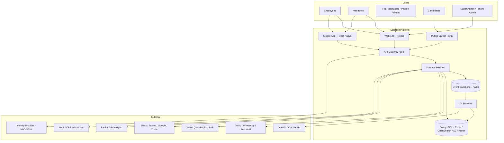

### 3.2 Container view (C4 — Level 2)

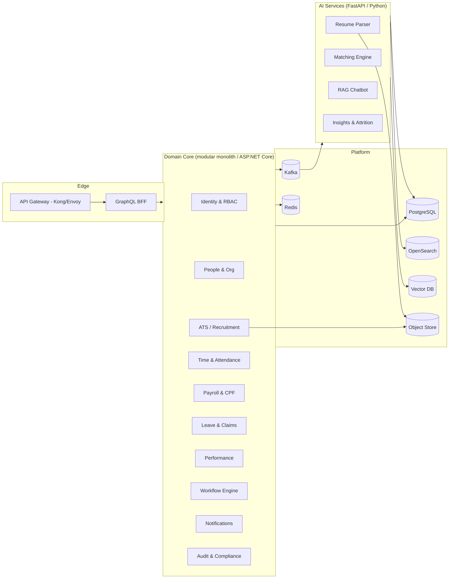

### 3.3 Request lifecycle (representative)

1. Client sends a request with a tenant-scoped JWT to the **API Gateway** (TLS termination, rate limit, WAF).
2. Gateway validates the token signature and forwards to the **GraphQL BFF**, which resolves the **tenant context** and **permission set** once and attaches them to the request.
3. The relevant **domain service** executes business logic inside a tenant-scoped DB transaction (Postgres **Row-Level Security** enforces isolation as a backstop — see §4).
4. On success, the service **commits** and **publishes a domain event** to Kafka (transactional outbox pattern — no event without a committed write).
5. Downstream consumers react: **audit** persists an immutable record, **notifications** fans out, **AI** re-indexes, **analytics** updates read models.
6. Response returns to the client; long-running side effects continue asynchronously.

---

## 4. Multi-tenant architecture

### 4.1 Isolation tiers

We offer three tiers on the same codebase, chosen per tenant by plan/compliance need:

| Tier | Isolation model | Who | Trade-off |
|------|-----------------|-----|-----------|
| **Pooled** | Shared DB, shared schema, `tenant_id` on every row + **Postgres RLS** | SMEs, default | Cheapest; isolation depends on RLS correctness |
| **Bridge** | Shared DB, **schema-per-tenant** | Mid-market, agencies with many sub-companies | Stronger isolation, per-tenant migration cost |
| **Siloed** | **Dedicated DB / cluster**, optionally dedicated region | Large enterprise, data-residency mandates | Most expensive; needed for some PDPA/GDPR cases |

The application code is **tenancy-mode agnostic**: a `TenantContext` resolver returns the right connection + search path. Promoting a tenant from Pooled → Siloed is a data-migration job, not a rewrite.

### 4.2 Tenant resolution

```mermaid
sequenceDiagram
    participant C as Client
    participant GW as Gateway
    participant TR as Tenant Resolver
    participant SVC as Domain Service
    participant DB as Postgres

    C->>GW: request (subdomain acme.SahaHR.app + JWT)
    GW->>TR: resolve tenant from subdomain/claim
    TR-->>GW: tenant_id, isolation_tier, db_route, branding
    GW->>SVC: request + TenantContext
    SVC->>DB: SET app.tenant_id = '...'; (RLS active)
    DB-->>SVC: only this tenant's rows
    SVC-->>C: response
```

### 4.3 Multi-company within a tenant

A single tenant (e.g. a staffing group) can contain **multiple legal companies** (entities). This is a *second* hierarchy below tenant:

```
Tenant (billing + branding boundary)
  └── Company / Legal Entity (payroll + compliance boundary)
        └── Department / Cost Center
              └── Team
```

Payroll, CPF, and IRAS submissions are **per company** (each has its own UEN, bank account, statutory profile). Employees belong to a company but can be shared/transferred across companies within the tenant with an audit trail. This distinction matters: tenant isolation is about *data privacy between customers*; company separation is about *legal/financial correctness within one customer*.

### 4.4 RLS enforcement (the safety net)

```sql
-- every tenant-scoped table carries tenant_id
ALTER TABLE employee ENABLE ROW LEVEL SECURITY;

CREATE POLICY tenant_isolation ON employee
  USING (tenant_id = current_setting('app.tenant_id')::uuid);

-- the app sets this per transaction; even a buggy query cannot cross tenants
```

RLS is a backstop, not the primary control — the ORM always filters by tenant too. Defense in depth.

---

## 5. Microservices breakdown

### 5.1 Bounded contexts

The system decomposes into these contexts. Each owns its data; no service reaches into another's tables — they talk via API or events.

| Context | Owns | Key events emitted |
|---------|------|--------------------|
| **Identity & Access** | users, roles, permissions, sessions, MFA, SSO config | `UserInvited`, `RoleAssigned`, `LoginSucceeded` |
| **People & Org** | employees, org units, positions, lifecycle, documents | `EmployeeHired`, `EmployeeTransferred`, `EmployeeTerminated` |
| **Recruitment (ATS)** | jobs, candidates, applications, stages, interviews, offers | `ApplicationMoved`, `OfferAccepted`, `CandidateHired` |
| **Time & Attendance** | shifts, rosters, punches, timesheets, geofences | `PunchRecorded`, `TimesheetApproved`, `OvertimeAccrued` |
| **Leave & Claims** | leave types, balances, requests, expense claims | `LeaveApproved`, `ClaimReimbursed` |
| **Payroll** | pay runs, salary structures, CPF, tax, payslips, bank files | `PayRunFinalized`, `PayslipIssued`, `CpfComputed` |
| **Performance** | goals, OKRs, reviews, feedback, competencies | `ReviewCompleted`, `GoalUpdated` |
| **Workflow** | definitions, instances, approvals, SLA timers | `WorkflowStarted`, `StepApproved`, `SlaBreached` |
| **Notifications** | templates, channels, deliveries (email/SMS/WhatsApp/push) | `NotificationSent` |
| **Audit & Compliance** | immutable audit log, consent, retention, DSAR | `ConsentGranted`, `DataExported` |
| **Analytics** | read-model projections, dashboards, exports | — (consumer) |
| **AI** | parsing, matching, RAG, insights | `ResumeParsed`, `MatchScored`, `AttritionFlagged` |

### 5.2 Service communication

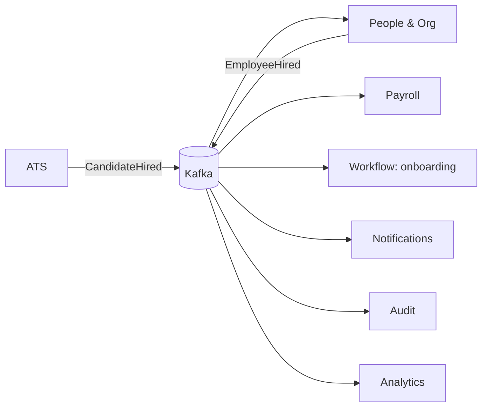

**Example flow — a hire becomes an employee:** ATS emits `CandidateHired` → People service creates the employee record and emits `EmployeeHired` → Workflow kicks off the onboarding process → Payroll provisions a salary record → Notifications welcomes the hire → Audit logs every step. No service called another directly; the choreography is the event log.

### 5.3 Why events, not synchronous chains

Synchronous service-to-service calls create distributed-monolith fragility (one slow service stalls a hire). Choreographed events give us: temporal decoupling, natural audit, replayability for analytics, and the ability to add a new consumer (e.g. a new BI tool) without touching producers.

### 5.4 Pragmatic decomposition strategy ⚠️

**Do not build 12 microservices on day one.** Recommended path:

- **Phase 1 (MVP):** One **modular monolith** (ASP.NET Core), with the bounded contexts above as *internal modules* enforcing strict boundaries (no cross-module imports of internals; communicate via an in-process event bus mirroring the future Kafka contract). The **AI services run separately** from day one (different language/runtime/scaling profile).
- **Phase 2:** Extract the first services where the seams strain hardest — typically **Payroll** (independent compute + compliance release cadence), **ATS** (different scaling, public traffic), and **Notifications** (spiky throughput).
- **Phase 3:** Extract further as team count and load justify it.

This keeps early velocity high while the event contracts and module boundaries make later extraction mechanical rather than traumatic.

---

## 6. Database schema

### 6.1 Schema design principles

- **Surrogate UUID PKs** everywhere (`uuid v7` for time-sortability).
- **`tenant_id` on every business table** (Pooled tier) + `company_id` where the entity is legal-entity-scoped (payroll, employees).
- **Soft delete** (`deleted_at`) — HR data is rarely hard-deleted (retention/audit); hard deletion happens only via the DSAR/retention job.
- **Temporal columns** (`effective_from`, `effective_to`) on records that change over time and where history is legally relevant (salary, position, org assignment). HR is fundamentally bitemporal — *what was true* vs *what we knew when*.
- **JSONB** for genuinely flexible/sparse data (profile custom fields, parsed resume payload) — never for data you filter or join on heavily.
- **Money as `numeric(18,4)`**, never float. Currency code stored alongside every amount.

### 6.2 Core ERD (identity, people, org)

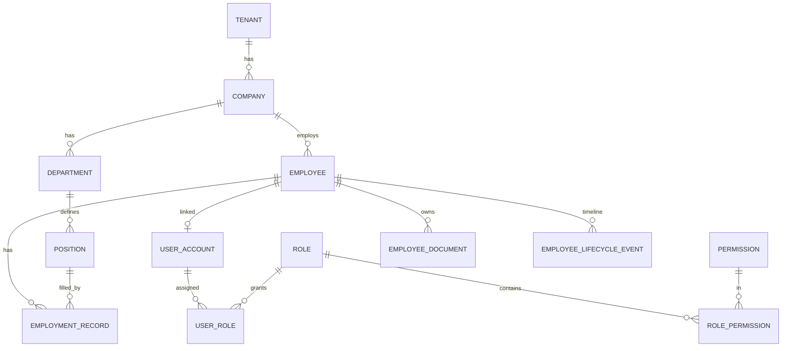

```sql
CREATE TABLE tenant (
  id            uuid PRIMARY KEY DEFAULT uuidv7(),
  name          text NOT NULL,
  subdomain     text UNIQUE NOT NULL,
  isolation_tier text NOT NULL DEFAULT 'pooled',   -- pooled|bridge|siloed
  plan          text NOT NULL DEFAULT 'standard',
  branding      jsonb NOT NULL DEFAULT '{}',
  region        text NOT NULL DEFAULT 'ap-southeast-1',
  created_at    timestamptz NOT NULL DEFAULT now(),
  deleted_at    timestamptz
);

CREATE TABLE company (                              -- legal entity
  id            uuid PRIMARY KEY DEFAULT uuidv7(),
  tenant_id     uuid NOT NULL REFERENCES tenant(id),
  legal_name    text NOT NULL,
  uen           text,                               -- SG Unique Entity Number
  country       char(2) NOT NULL DEFAULT 'SG',
  base_currency char(3) NOT NULL DEFAULT 'SGD',
  cpf_employer_ref text,
  iras_profile  jsonb,
  created_at    timestamptz NOT NULL DEFAULT now(),
  deleted_at    timestamptz
);

CREATE TABLE department (
  id          uuid PRIMARY KEY DEFAULT uuidv7(),
  tenant_id   uuid NOT NULL,
  company_id  uuid NOT NULL REFERENCES company(id),
  parent_id   uuid REFERENCES department(id),       -- self-ref org tree
  name        text NOT NULL,
  cost_center text
);

CREATE TABLE employee (
  id              uuid PRIMARY KEY DEFAULT uuidv7(),
  tenant_id       uuid NOT NULL,
  company_id      uuid NOT NULL REFERENCES company(id),
  employee_no     text NOT NULL,
  first_name      text NOT NULL,
  last_name       text NOT NULL,
  work_email      text,
  -- PII below is encrypted at column level (see §8.3)
  national_id_enc bytea,                            -- NRIC/FIN, encrypted
  dob_enc         bytea,
  bank_account_enc bytea,
  status          text NOT NULL DEFAULT 'active',   -- active|on_leave|terminated
  hire_date       date,
  termination_date date,
  custom_fields   jsonb NOT NULL DEFAULT '{}',
  created_at      timestamptz NOT NULL DEFAULT now(),
  deleted_at      timestamptz,
  UNIQUE (company_id, employee_no)
);

-- bitemporal: who reports to whom, what position, what pay grade, when
CREATE TABLE employment_record (
  id             uuid PRIMARY KEY DEFAULT uuidv7(),
  tenant_id      uuid NOT NULL,
  employee_id    uuid NOT NULL REFERENCES employee(id),
  position_id    uuid REFERENCES position(id),
  manager_id     uuid REFERENCES employee(id),
  department_id  uuid REFERENCES department(id),
  employment_type text NOT NULL,                    -- full_time|part_time|contract
  effective_from date NOT NULL,
  effective_to   date,                              -- null = current
  created_at     timestamptz NOT NULL DEFAULT now()
);

CREATE TABLE employee_lifecycle_event (
  id          uuid PRIMARY KEY DEFAULT uuidv7(),
  tenant_id   uuid NOT NULL,
  employee_id uuid NOT NULL REFERENCES employee(id),
  event_type  text NOT NULL,   -- onboarded|promoted|transferred|appraised|offboarded
  payload     jsonb NOT NULL DEFAULT '{}',
  occurred_at timestamptz NOT NULL DEFAULT now()
);
```

### 6.3 RBAC schema

```sql
CREATE TABLE user_account (
  id          uuid PRIMARY KEY DEFAULT uuidv7(),
  tenant_id   uuid NOT NULL,
  employee_id uuid REFERENCES employee(id),         -- null for external recruiters etc.
  email       text NOT NULL,
  status      text NOT NULL DEFAULT 'active',
  mfa_enabled boolean NOT NULL DEFAULT false,
  sso_subject text,                                  -- external IdP subject id
  UNIQUE (tenant_id, email)
);

CREATE TABLE role (
  id        uuid PRIMARY KEY DEFAULT uuidv7(),
  tenant_id uuid NOT NULL,
  key       text NOT NULL,        -- super_admin|hr_admin|recruiter|payroll_admin|manager|employee|interviewer
  name      text NOT NULL,
  is_system boolean NOT NULL DEFAULT false
);

CREATE TABLE permission (
  id    uuid PRIMARY KEY DEFAULT uuidv7(),
  key   text UNIQUE NOT NULL      -- e.g. 'payroll.run.finalize', 'candidate.read', 'employee.salary.read'
);

CREATE TABLE role_permission (
  role_id       uuid NOT NULL REFERENCES role(id),
  permission_id uuid NOT NULL REFERENCES permission(id),
  -- optional field/row scoping conditions
  constraints   jsonb NOT NULL DEFAULT '{}',         -- e.g. {"scope":"own_team"}
  PRIMARY KEY (role_id, permission_id)
);

CREATE TABLE user_role (
  user_id uuid NOT NULL REFERENCES user_account(id),
  role_id uuid NOT NULL REFERENCES role(id),
  scope   jsonb NOT NULL DEFAULT '{}',               -- e.g. {"company_id":"...","department_id":"..."}
  PRIMARY KEY (user_id, role_id)
);
```

Permissions are **dot-namespaced** (`module.entity.action`) enabling wildcard grants (`payroll.*`) and field-level control (`employee.salary.read` is separate from `employee.read`).

### 6.4 ATS schema (excerpt)

```sql
CREATE TABLE job (
  id           uuid PRIMARY KEY DEFAULT uuidv7(),
  tenant_id    uuid NOT NULL,
  company_id   uuid NOT NULL,
  title        text NOT NULL,
  description  text,
  status       text NOT NULL DEFAULT 'draft',   -- draft|open|on_hold|closed
  location     text,
  employment_type text,
  pipeline_id  uuid NOT NULL REFERENCES pipeline(id),
  posted_at    timestamptz,
  created_by   uuid
);

CREATE TABLE pipeline (                            -- configurable hiring stages
  id        uuid PRIMARY KEY DEFAULT uuidv7(),
  tenant_id uuid NOT NULL,
  name      text NOT NULL,
  stages    jsonb NOT NULL    -- ordered: [{key:'applied',name:'Applied'},...]
);

CREATE TABLE candidate (
  id            uuid PRIMARY KEY DEFAULT uuidv7(),
  tenant_id     uuid NOT NULL,
  full_name     text,
  email         text,
  phone_enc     bytea,
  source        text,         -- portal|referral|sourced|agency
  resume_s3_key text,
  parsed        jsonb,        -- AI resume parse output
  consent       jsonb,        -- PDPA consent record
  created_at    timestamptz NOT NULL DEFAULT now()
);

CREATE TABLE application (
  id            uuid PRIMARY KEY DEFAULT uuidv7(),
  tenant_id     uuid NOT NULL,
  job_id        uuid NOT NULL REFERENCES job(id),
  candidate_id  uuid NOT NULL REFERENCES candidate(id),
  current_stage text NOT NULL DEFAULT 'applied',
  match_score   numeric(5,2),       -- AI match %
  status        text NOT NULL DEFAULT 'active',  -- active|rejected|hired|withdrawn
  created_at    timestamptz NOT NULL DEFAULT now(),
  UNIQUE (job_id, candidate_id)
);

CREATE TABLE interview (
  id            uuid PRIMARY KEY DEFAULT uuidv7(),
  tenant_id     uuid NOT NULL,
  application_id uuid NOT NULL REFERENCES application(id),
  scheduled_at  timestamptz,
  interviewers  uuid[],
  scorecard     jsonb
);

CREATE TABLE offer (
  id            uuid PRIMARY KEY DEFAULT uuidv7(),
  tenant_id     uuid NOT NULL,
  application_id uuid NOT NULL REFERENCES application(id),
  salary        numeric(18,4),
  currency      char(3),
  status        text NOT NULL DEFAULT 'draft',  -- draft|sent|accepted|declined
  document_s3_key text,
  sent_at       timestamptz,
  responded_at  timestamptz
);
```

### 6.5 Payroll, time, leave schema (excerpt)

```sql
CREATE TABLE salary_structure (
  id          uuid PRIMARY KEY DEFAULT uuidv7(),
  tenant_id   uuid NOT NULL,
  employee_id uuid NOT NULL REFERENCES employee(id),
  effective_from date NOT NULL,
  effective_to   date,
  basic       numeric(18,4) NOT NULL,
  currency    char(3) NOT NULL DEFAULT 'SGD',
  components  jsonb NOT NULL DEFAULT '[]'   -- allowances, fixed/variable, taxable flags
);

CREATE TABLE pay_run (
  id          uuid PRIMARY KEY DEFAULT uuidv7(),
  tenant_id   uuid NOT NULL,
  company_id  uuid NOT NULL,
  period      daterange NOT NULL,
  status      text NOT NULL DEFAULT 'draft',  -- draft|calculated|approved|finalized|paid
  rate_table_version text NOT NULL,           -- CPF/tax ruleset version used
  created_by  uuid,
  approved_by uuid,
  finalized_at timestamptz
);

CREATE TABLE payslip (
  id           uuid PRIMARY KEY DEFAULT uuidv7(),
  tenant_id    uuid NOT NULL,
  pay_run_id   uuid NOT NULL REFERENCES pay_run(id),
  employee_id  uuid NOT NULL REFERENCES employee(id),
  gross        numeric(18,4) NOT NULL,
  cpf_employee numeric(18,4) NOT NULL,
  cpf_employer numeric(18,4) NOT NULL,
  tax          numeric(18,4) NOT NULL DEFAULT 0,
  deductions   numeric(18,4) NOT NULL DEFAULT 0,
  net          numeric(18,4) NOT NULL,
  breakdown    jsonb NOT NULL,                 -- full line-item explainability
  pdf_s3_key   text
);

CREATE TABLE attendance_punch (
  id          uuid PRIMARY KEY DEFAULT uuidv7(),
  tenant_id   uuid NOT NULL,
  employee_id uuid NOT NULL,
  punch_type  text NOT NULL,            -- in|out|break_start|break_end
  ts          timestamptz NOT NULL,
  source      text NOT NULL,            -- biometric|qr|mobile_gps|web
  geo         geography(Point),         -- PostGIS
  geofence_id uuid,
  selfie_s3_key text,
  device_id   text,
  is_synced   boolean NOT NULL DEFAULT true   -- offline sync flag
);

CREATE TABLE leave_request (
  id          uuid PRIMARY KEY DEFAULT uuidv7(),
  tenant_id   uuid NOT NULL,
  employee_id uuid NOT NULL,
  leave_type  text NOT NULL,
  start_date  date NOT NULL,
  end_date    date NOT NULL,
  days        numeric(5,2) NOT NULL,
  status      text NOT NULL DEFAULT 'pending',
  workflow_instance_id uuid
);
```

### 6.6 Audit & consent schema

```sql
-- append-only; no UPDATE/DELETE grants for the app role
CREATE TABLE audit_log (
  id          uuid PRIMARY KEY DEFAULT uuidv7(),
  tenant_id   uuid NOT NULL,
  actor_id    uuid,
  actor_type  text,                  -- user|system|ai
  action      text NOT NULL,         -- e.g. 'payroll.finalize'
  entity_type text,
  entity_id   uuid,
  before      jsonb,
  after       jsonb,
  ip          inet,
  user_agent  text,
  occurred_at timestamptz NOT NULL DEFAULT now()
) PARTITION BY RANGE (occurred_at);  -- monthly partitions for scale/retention

CREATE TABLE consent_record (
  id          uuid PRIMARY KEY DEFAULT uuidv7(),
  tenant_id   uuid NOT NULL,
  subject_id  uuid NOT NULL,        -- employee or candidate
  purpose     text NOT NULL,        -- recruitment|payroll|marketing
  granted     boolean NOT NULL,
  basis       text,                 -- consent|contract|legal_obligation
  granted_at  timestamptz,
  withdrawn_at timestamptz,
  evidence    jsonb
);
```

### 6.7 Indexing & performance notes

- Composite index `(tenant_id, <hot filter>)` on every large table — the tenant column leads every index because every query is tenant-scoped.
- `application(job_id, current_stage)` for Kanban board loads.
- `attendance_punch(employee_id, ts DESC)` for timesheet aggregation.
- GIN indexes on `custom_fields` and `parsed` JSONB where searched.
- `audit_log` partitioned monthly; old partitions detached to cold storage per retention policy.
- Read-heavy analytics never hit OLTP tables directly — they read **materialized projections** built by the Analytics consumer from the event stream (CQRS read side).

---

## 7. Authentication & authorization flow

### 7.1 AuthN flow (login + SSO + MFA)

```mermaid
sequenceDiagram
    participant U as User
    participant APP as Web/Mobile
    participant IDP as Identity Service (Keycloak/Auth0)
    participant GW as API Gateway
    participant SVC as Domain Service

    U->>APP: enter email / click SSO
    alt Enterprise SSO (SAML/OIDC)
        APP->>IDP: redirect to tenant's IdP
        IDP-->>APP: id_token + access_token
    else Password
        APP->>IDP: credentials
        IDP->>IDP: verify + check MFA policy
        IDP-->>U: MFA challenge (TOTP/WebAuthn)
        U-->>IDP: factor
        IDP-->>APP: tokens
    end
    APP->>GW: API call + access_token (short-lived JWT)
    GW->>GW: verify signature, exp, tenant claim
    GW->>SVC: forward + TenantContext + permissions
    SVC-->>APP: authorized response
    Note over APP,IDP: refresh_token rotation; access_token TTL ~15min
```

- **Tokens:** short-lived access JWT (~15 min) + rotating refresh token (httpOnly, secure cookie on web; secure storage on mobile). JWT carries `tenant_id`, `user_id`, `roles`, and a `perm_version` (bump invalidates cached perms on role change).
- **SSO:** SAML 2.0 and OIDC per tenant; SCIM 2.0 for automated user provisioning/deprovisioning from the customer's IdP.
- **MFA:** TOTP and WebAuthn/passkeys; policy enforceable per role (e.g. payroll admins *must* use MFA).
- **Session management:** Redis-backed session registry enables admin "revoke all sessions" and device listing.

### 7.2 AuthZ — permission evaluation

Authorization is checked at three depths:

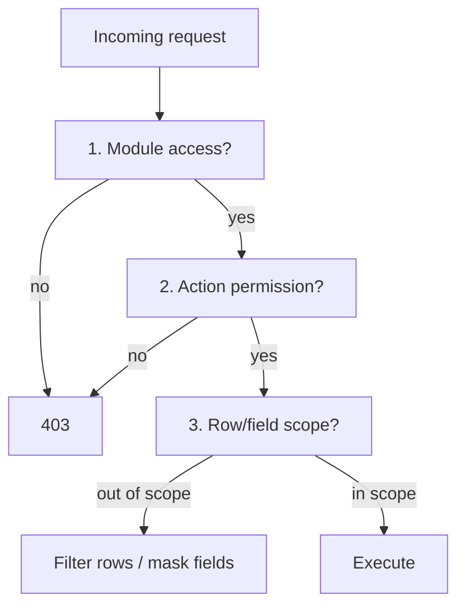

1. **Module-level:** does this user's role set grant any access to the module?
2. **Action-level:** the specific permission key (`payroll.run.finalize`).
3. **Row/field-level:** scope constraints — a manager sees only `own_team`; salary fields masked unless `employee.salary.read` is held. Enforced both in the query layer and as Postgres RLS/column masking backstop.

A central **PolicyService** (think lightweight OPA/Cedar) evaluates a `(subject, action, resource, context)` tuple so the rules live in one place, are testable, and are auditable.

---

## 8. Security architecture

### 8.1 Defense-in-depth overview

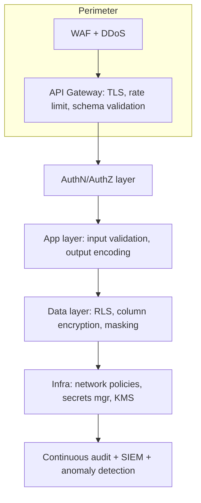

### 8.2 Controls by layer

| Layer | Controls |
|-------|----------|
| Network | Private subnets, K8s NetworkPolicies (default-deny), mTLS between services, no public DB |
| Transport | TLS 1.3 everywhere; HSTS; cert rotation |
| App | OWASP ASVS baseline, input validation, parameterized queries (no string SQL), CSRF protection, output encoding, dependency scanning |
| Data | Encryption at rest (KMS-managed keys, per-tenant DEKs for siloed), column encryption for PII, RLS, dynamic masking |
| Secrets | Vault / AWS Secrets Manager; no secrets in env files or code; short-lived DB creds |
| Identity | MFA, SSO, least-privilege IAM, session revocation |
| Supply chain | SBOM, image signing, pinned dependencies, CVE gating in CI |

### 8.3 PII encryption strategy

- **NRIC/FIN, DOB, bank details** stored encrypted at column level (envelope encryption: data key per tenant wrapped by KMS master key).
- Decryption happens only in the service layer for users holding the relevant permission; encrypted blobs are never returned to clients.
- Search over encrypted fields uses **blind indexes** (HMAC of normalized value) rather than decrypting at scale.

### 8.4 Data protection & compliance (PDPA + GDPR)

> **Important caveat:** This describes an architecture *designed to support* PDPA/GDPR compliance. Compliance is an organizational + legal outcome, not a code feature. The platform provides the controls; the operating customer must configure policies, sign DPAs, and conduct DPIAs. Have qualified counsel validate before go-live — I'm describing engineering controls, not giving legal advice.

| Requirement | Architectural mechanism |
|-------------|------------------------|
| Lawful basis & consent | `consent_record` table; consent captured at candidate apply / employee onboarding; withdrawal supported |
| Right of access (DSAR) | "Export my data" job aggregates all subject data across services into a portable package |
| Right to erasure | Retention/erasure job hard-deletes or irreversibly anonymizes after retention window, honoring legal-hold exceptions (payroll records have statutory retention) |
| Data minimization | Field-level permissions; PII collected only with declared purpose |
| Purpose limitation | Consent `purpose` checked before processing (e.g. can't use recruitment data for marketing) |
| Data residency | Region pinning per tenant (`tenant.region`); siloed tier for residency-mandated customers |
| Breach readiness | Immutable audit log + SIEM alerting + documented IR runbook |
| Retention | Per-tenant, per-data-type retention policies enforced by scheduled jobs |
| DPO / records of processing | Admin console surfaces processing activities and consent ledgers |

### 8.5 Audit logging

- **Append-only**, partitioned `audit_log` (§6.6); the app DB role has `INSERT` only — no `UPDATE`/`DELETE`.
- Every state-changing action and every sensitive *read* (viewing salary, exporting candidate data) is logged with actor, before/after, IP, and timestamp.
- AI actions are logged as `actor_type='ai'` with the model + prompt version for explainability.
- Logs shipped to a tamper-evident store (e.g. hashing chain / WORM bucket) for forensic integrity.

---

## 9. API specifications

### 9.1 API surfaces

| Surface | Protocol | Audience | Auth |
|---------|----------|----------|------|
| **App BFF** | GraphQL | First-party web/mobile | User JWT |
| **Public/Partner API** | REST (OpenAPI 3.1) | Integrations, customer dev teams | OAuth2 client-credentials + scopes |
| **Webhooks** | Outbound HTTP (signed) | Customer/integration listeners | HMAC signature |
| **Marketplace** | REST + OAuth | Third-party apps | OAuth2 authorization-code |

### 9.2 REST conventions

- Base: `https://api.SahaHR.app/v1`
- Tenant scoping via the OAuth token (never in the URL — avoids leaking tenant in logs).
- Standard verbs, cursor pagination (`?cursor=&limit=`), `RFC 7807` problem+json errors, idempotency keys on POST for payroll/financial ops.
- Rate limits per client + per tenant, surfaced via `RateLimit-*` headers.

### 9.3 Representative REST endpoints

```http
# Recruitment
POST   /v1/jobs
GET    /v1/jobs/{id}/applications?stage=interview&cursor=...
PATCH  /v1/applications/{id}            # move stage (idempotent)
POST   /v1/applications/{id}/offers
POST   /v1/candidates/{id}/resume       # multipart -> triggers async parse

# People
POST   /v1/employees
GET    /v1/employees/{id}
POST   /v1/employees/{id}/transfers

# Payroll  (sensitive -> stricter scopes + MFA-stepped tokens)
POST   /v1/pay-runs                      # create draft
POST   /v1/pay-runs/{id}/calculate       # async compute
POST   /v1/pay-runs/{id}/approve
POST   /v1/pay-runs/{id}/finalize        # irreversible -> idempotency-key required
GET    /v1/payslips/{id}

# Attendance
POST   /v1/attendance/punch              # mobile/biometric/web
GET    /v1/timesheets/{employeeId}?period=2026-05
```

### 9.4 GraphQL BFF (excerpt)

```graphql
type Query {
  me: User!
  candidate(id: ID!): Candidate
  pipeline(jobId: ID!): [StageColumn!]!     # powers Kanban
  payslip(id: ID!): Payslip
  leaveBalance(employeeId: ID!): [LeaveBalance!]!
}

type Mutation {
  moveApplication(id: ID!, toStage: String!): Application!
  submitLeaveRequest(input: LeaveInput!): LeaveRequest!
  approveStep(workflowInstanceId: ID!, decision: Decision!): WorkflowStep!
}

type Subscription {
  applicationMoved(jobId: ID!): Application!  # live Kanban via WebSocket
}
```

### 9.5 Webhooks

```jsonc
// POST to customer endpoint, signed with X-SahaHR-Signature: sha256=...
{
  "event": "candidate.hired",
  "tenant_id": "...",
  "occurred_at": "2026-05-29T08:00:00Z",
  "data": { "application_id": "...", "candidate_id": "...", "job_id": "..." }
}
```

Events mirror the internal Kafka topics. At-least-once delivery with retries + dead-letter; customers verify the HMAC and dedupe on event id.

### 9.6 Integration marketplace

The marketplace is an OAuth2 provider + app directory. Third-party apps request **scoped** grants (`read:candidates`, `write:timesheets`). Native first-party connectors (Slack, Teams, Google/Outlook, Zoom, Calendly, Xero, QuickBooks, SAP, Oracle) are built on the same public API + webhook contract — proving the API is complete enough for partners by dogfooding it.

---

## 10. ATS workflow design

### 10.1 Pipeline state machine

Stages are **tenant-configurable** (stored in `pipeline.stages`), but ship with the requested default:

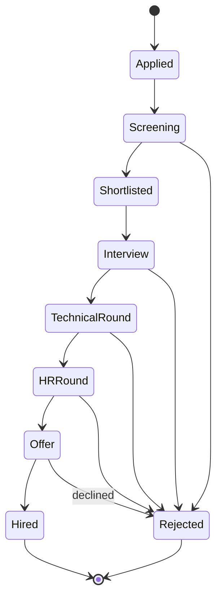

Each transition: validates allowed moves, records an `audit_log` entry + `ApplicationMoved` event, may trigger automations (auto-email on move to Interview), and updates the Kanban read model that the board subscribes to over WebSocket.

### 10.2 End-to-end recruitment flow

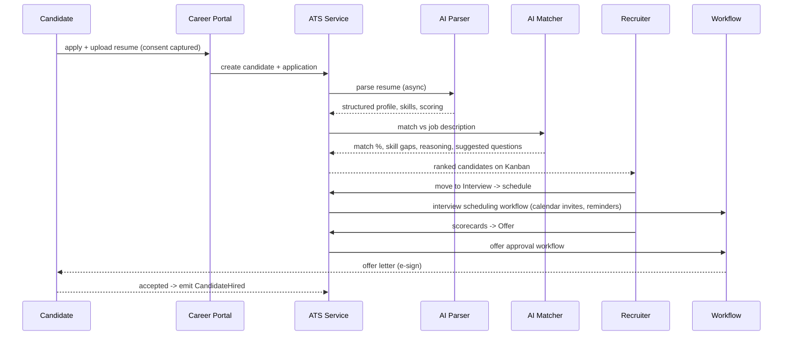

### 10.3 Key ATS capabilities mapped

- **Career portal** — Next.js SSR pages, SEO-optimized, multilingual (§14.3).
- **AI JD generator** — §11.5.
- **Scorecards** — structured `scorecard` JSONB per interview with weighted competencies → roll-up score.
- **Talent pools / referrals** — candidates tagged into pools; referral source tracked on `candidate.source` with referrer attribution for reward workflows.
- **Hiring team collaboration** — scoped roles (`interviewer` sees only assigned candidates + their own scorecard).
- **Hiring analytics** — funnel conversion, time-in-stage, source quality, computed in the Analytics read model.

---

## 11. AI architecture

### 11.1 Principles

- AI services are **separate** (Python/FastAPI), scale independently, and never block core transactions.
- **Model-agnostic gateway:** an internal `AIGateway` abstracts OpenAI / Anthropic Claude / open models behind one interface, with per-tenant model routing, cost caps, prompt versioning, and full audit. Switching providers is config.
- **Human-in-the-loop:** AI outputs are advisory. No AI action is irreversible or unattended (no auto-reject, no auto-finalized payroll).
- **PII discipline:** candidate/employee PII sent to external LLMs is minimized, redacted where possible, and governed by the tenant's data-processing settings. Tenants can opt for self-hosted models for sensitive data.

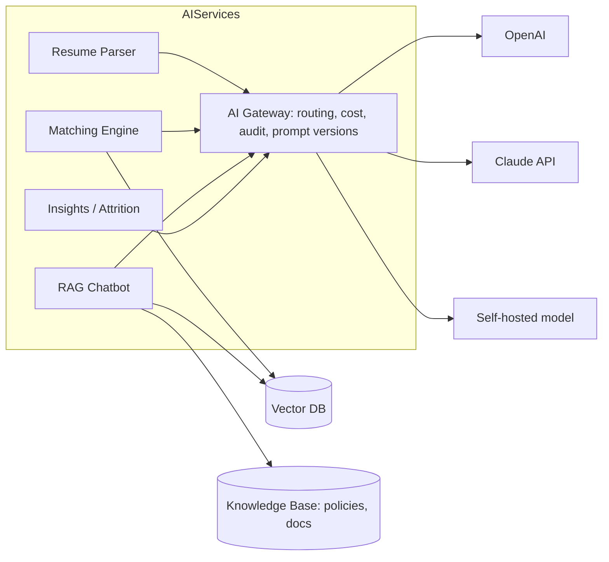

### 11.2 Resume parsing pipeline

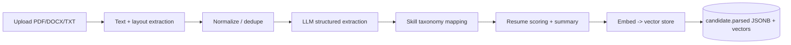

Extracts: contact, experience, education, skills; produces resume score, candidate summary, smart tags, duplicate detection (via embedding similarity + blind-indexed email/phone), and skill-gap analysis vs target roles.

### 11.3 Candidate↔JD matching engine

Hybrid scoring, not a single number from a black box:

```
match_score =  w1 * semantic_similarity(resume_vec, jd_vec)
             + w2 * skill_overlap(required_skills, candidate_skills)
             + w3 * experience_relevance(years, domain)
             + w4 * education/cert_fit
```

- **Semantic** layer: cosine similarity of resume and JD embeddings (pgvector/Pinecone).
- **Structured** layer: explicit skill/experience overlap so scores are *explainable* and *defensible* (important for hiring-bias scrutiny).
- Output: match %, per-dimension breakdown, **AI reasoning text**, skill compatibility, and **suggested interview questions** targeting gaps.
- **Fairness guardrail:** matching never ingests protected attributes; scores are auditable; recruiters always make the final call.

### 11.4 RAG HR chatbot

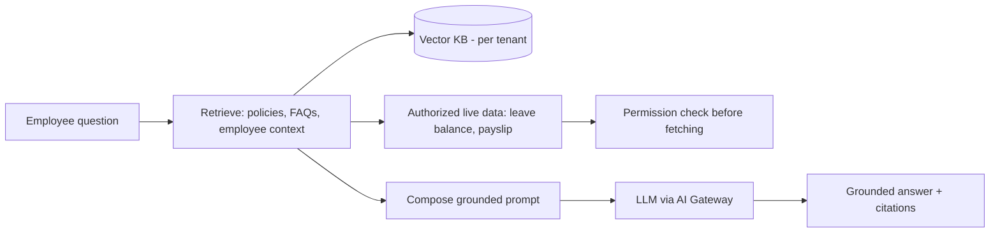

- **Tenant-isolated knowledge base** — one tenant's policies never leak into another's answers.
- **Grounded + cited** — answers cite the source policy; the bot says "I don't know / contact HR" rather than hallucinating on policy questions.
- **Permission-aware** — "what's my leave balance?" fetches live data *only after* the same AuthZ checks a UI action would face. The bot cannot reveal another employee's data.
- Capabilities: HR policy Q&A, leave/payroll queries, onboarding assistant, candidate-screening assistant, HR document search.

### 11.5 Generative & predictive features

| Feature | Approach | Guardrail |
|---------|----------|-----------|
| JD generator | LLM from role + competencies + tenant tone | Human edits before publish |
| Employee insights | Summaries over performance/engagement data | Aggregated; advisory |
| **Attrition prediction** | ML model on tenure, engagement, comp, review signals | Flags *risk*, never auto-acts; explainable features; bias-tested |
| Workflow suggestions | Pattern detection on approval data | Suggests, admin approves |
| Analytics summaries | LLM narrates dashboard read models | Numbers come from data, not the LLM |

> Predictive people-analytics (especially attrition) carries real ethical and legal weight. Treat outputs as decision *support*, document the model, test for disparate impact, and keep humans accountable. Surface this to customers explicitly.

---

## 12. Payroll & CPF engine logic

> **Critical accuracy caveat:** Singapore CPF contribution rates, wage ceilings, age bands, and IRAS tax rules **change periodically** (almost every year for CPF). **Do not hard-code rates.** The figures below illustrate the *engine mechanics*; the actual numbers must be loaded from a **versioned rate table** sourced from the current CPF Board and IRAS publications and verified by a payroll/compliance specialist before each affected pay run. The architecture treats rates as data precisely so a rate change is a config update, not a code release.

### 12.1 Engine design — rules as versioned data

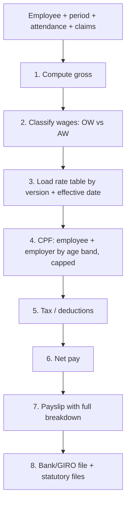

Each `pay_run` records the `rate_table_version` it used → reproducible, auditable, and re-runnable.

### 12.2 Wage classification

Singapore CPF distinguishes:
- **Ordinary Wages (OW)** — monthly salary, subject to a monthly OW ceiling.
- **Additional Wages (AW)** — bonuses, etc., subject to an annual AW ceiling computed against OW already contributed.

The engine classifies every salary component (`salary_structure.components[].wage_type`) and applies the correct ceiling.

### 12.3 CPF computation (mechanics — rates are illustrative placeholders)

```python
# Pseudocode. RATE VALUES ARE PLACEHOLDERS — load real ones from the
# versioned rate table sourced from CPF Board. Verify before use.

def compute_cpf(employee, ordinary_wages, additional_wages, rate_table):
    band = rate_table.age_band(employee.age_on(period_end))   # e.g. <=55, 55-60...
    ow_ceiling = rate_table.ow_monthly_ceiling                # changes over time

    capped_ow = min(ordinary_wages, ow_ceiling)

    # employee & employer percentages depend on age band + residency status
    emp_pct = band.employee_pct      # <-- from rate table, NOT hard-coded
    er_pct  = band.employer_pct

    cpf_ow_employee = round_cpf(capped_ow * emp_pct)
    cpf_ow_employer = round_cpf(capped_ow * er_pct)

    # AW subject to annual ceiling: AW_ceiling = annual_cap - total_OW_ytd
    aw_room = rate_table.aw_annual_cap - employee.ow_subject_ytd
    capped_aw = max(0, min(additional_wages, aw_room))
    cpf_aw_employee = round_cpf(capped_aw * emp_pct)
    cpf_aw_employer = round_cpf(capped_aw * er_pct)

    return CpfResult(
        employee = cpf_ow_employee + cpf_aw_employee,
        employer = cpf_ow_employer + cpf_aw_employer,
        rate_version = rate_table.version,   # stamped onto the payslip
    )
```

Notes the engine must honor: age-band rates, PR (permanent resident) graduated rates for the first years, residency status, CPF rounding rules, and statutory minimum/maximum handling. All of these live in the **rate table**, keyed by effective date and version.

### 12.4 Full pay calculation

```
gross        = basic + taxable_allowances + overtime + variable
            (overtime from approved timesheets; claims reimbursed separately, non-CPF)
cpf_employee, cpf_employer = compute_cpf(...)
tax          = compute_tax(...)        # IRAS rules; most employees not withheld monthly,
                                       # but engine supports it + year-end IR8A reporting
deductions   = cpf_employee + tax + other_authorized
net          = gross - cpf_employee - tax - other_deductions
employer_cost = gross + cpf_employer + other_employer_contributions (e.g. SDL)
```

### 12.5 Statutory outputs

- **Payslips** (itemized, with `breakdown` JSONB so every figure is explainable on screen).
- **CPF submission file** for the CPF Board (per company UEN).
- **IRAS reporting** (e.g. IR8A / AIS year-end) — generated from finalized pay runs.
- **Bank/GIRO** disbursement file.
- **Multi-country readiness:** the rate-table + rule-engine pattern generalizes — a new country is a new ruleset + statutory file template, not new engine code.

### 12.6 Controls

- Pay run is a **state machine** (`draft → calculated → approved → finalized → paid`); finalize is **irreversible** and requires the `payroll.run.finalize` permission + idempotency key.
- Maker–checker: the user who calculates cannot be the sole approver (segregation of duties).
- Every run fully reproducible from inputs + stamped rate version.
- Complete `audit_log` trail; payslip PDFs stored encrypted with statutory-retention policy.

---

## 13. Workflow automation engine

### 13.1 Capabilities

A no-code, drag-and-drop builder producing **declarative workflow definitions** (JSON) executed by a durable engine (Temporal recommended for long-running/human-in-loop flows).

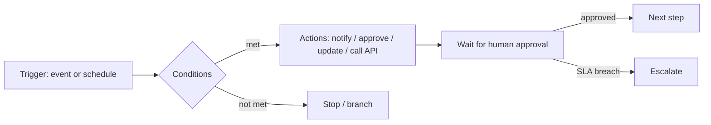

### 13.2 Definition shape

```jsonc
{
  "name": "Leave approval (multi-level)",
  "trigger": { "type": "event", "event": "leave.requested" },
  "steps": [
    { "id": "mgr", "type": "approval", "approver": "{{employee.manager}}",
      "sla_hours": 24, "on_timeout": "escalate" },
    { "id": "hr",  "type": "approval", "approver": "role:hr_admin",
      "condition": "{{request.days > 5}}" },
    { "type": "action", "action": "leave.approve" },
    { "type": "action", "action": "notify",
      "channel": ["email","slack"], "template": "leave_approved" }
  ]
}
```

Triggers (events or cron), conditions, actions (notify, approve, update entity, call external API, run sub-workflow), waits, SLA timers with escalation, and full **workflow logs** for every instance. Used for recruitment flows, leave/payroll/claim approvals, onboarding/offboarding, and scheduled automation.

---

## 14. UI/UX architecture, wireframes & dashboards

### 14.1 Design system

- **Foundation:** Tailwind + shadcn/ui (Radix) → accessible-by-default (WCAG 2.1 AA), keyboard-navigable, themeable.
- **Theming:** CSS variables drive light/dark mode + per-tenant branding (logo, primary color) resolved from `tenant.branding`.
- **Motion:** Framer Motion for purposeful transitions (stage moves, drawer opens) — never decorative-only.
- **Data density:** enterprise tables with virtualized rows, column config, saved views, bulk actions, server-side sort/filter/paginate.
- **Aesthetic:** minimal, neutral, "calm enterprise" — Workday/Rippling restraint, not consumer flash.

### 14.2 Information architecture

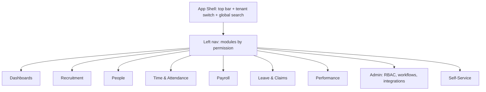

Navigation renders **only modules the user's permissions allow** — a plain employee never sees Payroll Admin.

### 14.3 Key screen wireframes (low-fidelity)

**ATS Kanban board**
```
┌───────────────────────────────────────────────────────────────────────┐
│ Senior Backend Engineer · 47 candidates        [+ Add]  [Filters ▾]    │
├──────────┬──────────┬──────────┬──────────┬──────────┬─────────────────┤
│ Applied  │Screening │Shortlist │Interview │ Offer    │ Hired           │
│  (18)    │  (9)     │  (7)     │  (5)     │  (2)     │  (1)            │
├──────────┼──────────┼──────────┼──────────┼──────────┼─────────────────┤
│ ┌──────┐ │ ┌──────┐ │ ┌──────┐ │ ┌──────┐ │ ┌──────┐ │                 │
│ │J. Tan│ │ │A. Lee│ │ │R. Ng │ │ │S. Lim│ │ │M. Goh│ │   drag cards    │
│ │92% ●●│ │ │88% ●●│ │ │95% ●●│ │ │90% ●●│ │ │93% ●●│ │   between cols  │
│ │SG·5y │ │ │SG·4y │ │ │SG·7y │ │ │SG·6y │ │ │SG·8y │ │                 │
│ └──────┘ │ └──────┘ │ └──────┘ │ └──────┘ │ └──────┘ │                 │
└──────────┴──────────┴──────────┴──────────┴──────────┴─────────────────┘
   AI match % on each card · click → candidate drawer (resume, score, scorecards)
```

**Candidate detail drawer**
```
┌─ Jasmine Tan ──────────────────────────────────  [Move ▾] [Reject] ──┐
│ Match 92%  │ Skills ✓Go ✓K8s ✓Postgres  ⚠ gap: Kafka                  │
│ ───────────────────────────────────────────────────────────────────  │
│ [Resume] [AI Summary] [Scorecards] [Emails] [Activity]               │
│ AI Summary: 5y backend, fintech, led 3-person team... [cite resume]   │
│ Suggested interview Qs: 1) Describe a Kafka use case you'd design...   │
└──────────────────────────────────────────────────────────────────────┘
```

**Payslip view (employee self-service)**
```
┌─ Payslip · May 2026 ─────────────────────────────  [Download PDF] ───┐
│ Earnings                    │ Deductions                              │
│  Basic           5,000.00   │  CPF (employee)        ...              │
│  Allowance         300.00   │  ─────────────────────────              │
│  Overtime          120.00   │  Net pay              X,XXX.00          │
│ ─────────────────────────── │  Employer CPF (info)   ...              │
│  Gross           5,420.00   │  Rate version: 2026.x  (stamped)        │
└──────────────────────────────────────────────────────────────────────┘
```

**Career portal (public)**
```
┌─ careers.acme.com ───────────────────────────────────────────────────┐
│  [Acme logo]                                   Search jobs [____] 🔍   │
│  ──────────────────────────────────────────────────────────────────  │
│  AI-recommended for you ▸ Senior Backend Eng · Product Designer ...    │
│  All openings (24)   [Dept ▾] [Location ▾] [Type ▾]                   │
│   • Senior Backend Engineer        Singapore · Full-time   [Apply →]   │
│   • Product Designer               Remote · Full-time      [Apply →]   │
└──────────────────────────────────────────────────────────────────────┘
   SSR + SEO meta · multilingual · mobile-first · one-click apply
```

### 14.4 Enterprise dashboard design

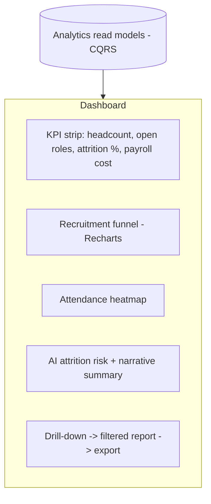

- **Role-aware dashboards:** CHRO sees cost/attrition/DEI; a recruiter sees their funnel; a manager sees their team. Custom dashboards via a widget grid.
- **Real-time widgets** fed by the analytics read models (not OLTP), so heavy dashboards never slow transactional flows.
- Drill-down → exportable reports (CSV/XLSX/PDF). AI narrates each dashboard ("attrition up 2pts, concentrated in Sales — see risk list").
- Analytics catalog: hiring funnel, turnover, payroll, attendance, productivity, recruitment KPIs, DEI, cost analysis, predictive.

---

## 15. Mobile app architecture

### 15.1 Overview

React Native (Expo) app sharing TypeScript domain types/validation with web. Primary jobs: **GPS attendance**, ESS (payslips, leave, claims), approvals on the go, and push notifications.

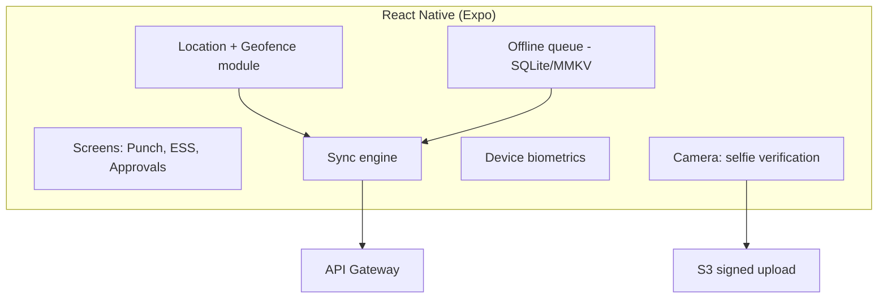

### 15.2 GPS attendance flow with offline support

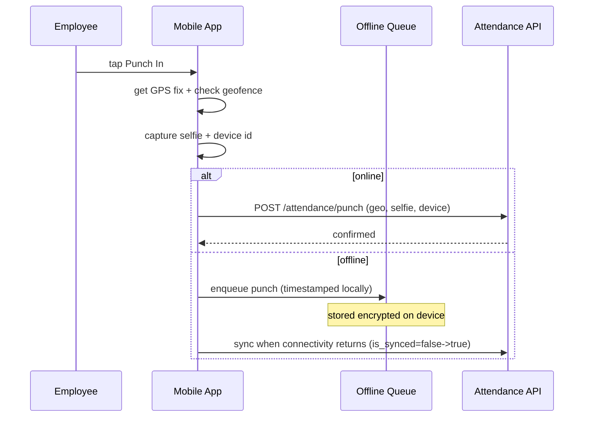

- **Geofencing:** punch validated against job-site polygons (PostGIS); out-of-fence punches flagged for regularization, not silently rejected.
- **Selfie + device auth** deter buddy-punching; images uploaded via signed URLs, encrypted at rest.
- **Offline-first:** punches queue locally (timestamped at capture, not at sync) and reconcile on reconnect — essential for field/low-signal workers.
- **Live tracking / route history** for field employees is **opt-in, consent-recorded, and purpose-limited** (PDPA): tracked only during shift, disclosed to the employee, retained per policy. Surveillance overreach is both a legal and trust risk — the design constrains it deliberately.
- **Privacy stance:** location collected only at punch events by default; continuous tracking requires explicit, revocable consent.

---

## 16. DevOps, deployment & scalable SaaS infrastructure

### 16.1 Topology

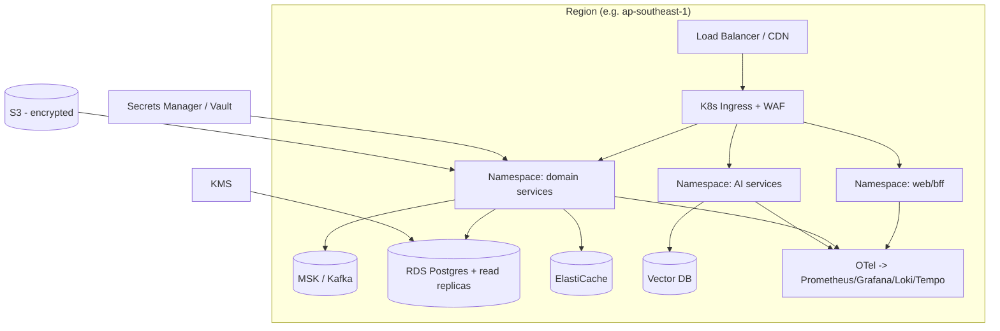

### 16.2 Scalability strategy

- **Stateless services** behind HPA (autoscale on CPU + custom metrics like queue depth).
- **Postgres:** vertical scale + read replicas for analytics/reporting; per-tenant DB for siloed tier; connection pooling (PgBouncer).
- **Kafka** partitioned by `tenant_id` for ordered per-tenant processing and parallelism.
- **Caching:** Redis for sessions, hot config, rate limits; CDN for portal/static.
- **Async heavy work** (parsing, payroll calc, exports) on worker pools (BullMQ/Temporal), never in the request path.
- **Multi-region** for residency + DR: active-passive to start, with region-pinned tenant data.

### 16.3 CI/CD

```mermaid
flowchart LR
    PR[PR] --> CI[Lint, typecheck, unit + integration tests]
    CI --> SEC[SAST, dependency + container scan, SBOM]
    SEC --> BUILD[Build + sign image]
    BUILD --> STAGE[Deploy to staging - ephemeral env per PR]
    STAGE --> E2E[E2E + smoke tests]
    E2E --> CD[Progressive prod deploy: canary -> rollout]
    CD --> MON[Monitor SLOs -> auto-rollback on breach]
```

- Trunk-based with short-lived branches; **ephemeral preview environments** per PR.
- **Database migrations** versioned (e.g. Prisma/Flyway), expand-contract pattern for zero-downtime; per-tenant migration orchestration for schema-per-tenant.
- **Progressive delivery:** canary + feature flags; automated rollback on SLO breach.
- **IaC:** Terraform for infra, Helm for app; everything reproducible.

### 16.4 Reliability & operations

- **SLOs** per service (availability, latency, error budget); alerting on burn rate.
- **Backups:** automated PITR for Postgres; cross-region replication for DR; **restore drills** scheduled (a backup you've never restored is a hope, not a backup).
- **DR targets:** documented RPO/RTO per tier; runbooks rehearsed.
- **Distributed tracing** across the event mesh ties a hire → onboarding → first payslip into one trace for debuggability.

---

## 17. Folder structure

A pragmatic monorepo (Turborepo/Nx) — modular monolith + separate AI services, ready for later service extraction.

```
SahaHR/
├── apps/
│   ├── web/                      # Next.js admin app + career portal
│   │   ├── app/                  # App Router (portal is SSR/ISR routes)
│   │   ├── components/           # shadcn/ui-based design system usage
│   │   ├── features/             # feature-sliced: ats/, payroll/, people/...
│   │   └── lib/                  # api client (GraphQL), auth, hooks
│   ├── mobile/                   # React Native (Expo)
│   │   ├── src/features/         # attendance/, ess/, approvals/
│   │   └── src/sync/             # offline queue + sync engine
│   └── api/                      # ASP.NET Core modular monolith (domain core)
│       ├── src/
│       │   ├── modules/
│       │   │   ├── identity/     # bounded context = module
│       │   │   ├── people/
│       │   │   ├── recruitment/
│       │   │   ├── time-attendance/
│       │   │   ├── payroll/
│       │   │   ├── leave-claims/
│       │   │   ├── performance/
│       │   │   ├── workflow/
│       │   │   ├── notifications/
│       │   │   └── audit/
│       │   ├── common/           # tenant-context, rbac guard, event bus
│       │   ├── events/           # domain event contracts (shared w/ Kafka)
│       │   └── main.ts
│       └── test/
├── services/
│   └── ai/                       # FastAPI (Python)
│       ├── gateway/              # model-agnostic AI gateway
│       ├── parser/               # resume parsing
│       ├── matcher/              # candidate<->JD matching
│       ├── rag/                  # chatbot + KB
│       └── insights/             # attrition / analytics summaries
├── packages/
│   ├── domain-types/             # shared TS types/validation (web+mobile+api)
│   ├── ui/                       # shared component library
│   ├── config/                   # eslint, tsconfig, tailwind preset
│   └── sdk/                      # generated API client for partners
├── infra/
│   ├── terraform/                # cloud infra as code
│   ├── helm/                     # k8s charts per service
│   └── migrations/               # versioned DB migrations
├── db/
│   └── schema/                   # SQL DDL, RLS policies, seed
├── .github/workflows/            # CI/CD pipelines
└── docs/
    └── architecture/             # this document + ADRs
```

Each `modules/<context>/` follows the same internal shape: `domain/` (entities, value objects), `application/` (use cases), `infrastructure/` (repos, adapters), `api/` (resolvers/controllers), `events/` (publishers/handlers) — so extracting it into its own service later is a lift-and-shift, not a rewrite.

---

## 18. Development roadmap

> Scope this large is a multi-year program, not a quarter. The roadmap is **value-sequenced**: ship a coherent, sellable slice early, then layer modules. Resist the urge to build all 19 modules before launching anything.

### 18.1 Phasing

```mermaid
gantt
    title SahaHR delivery roadmap (indicative)
    dateFormat YYYY-MM
    section Phase 0 — Foundation
    Architecture, IaC, CI/CD, tenancy, identity/RBAC, audit core   :p0, 2026-06, 3M
    section Phase 1 — Core HR + ATS (MVP)
    People & Org, ESS, ATS pipeline, career portal, resume parsing :p1, after p0, 4M
    section Phase 2 — Payroll + Time
    Time & attendance, mobile GPS, payroll/CPF engine, leave/claims :p2, after p1, 4M
    section Phase 3 — Intelligence
    AI matching, RAG chatbot, analytics dashboards, attrition       :p3, after p2, 3M
    section Phase 4 — Enterprise scale
    Workflow builder, marketplace/integrations, performance, multi-country :p4, after p3, 4M
```

### 18.2 What each phase delivers

**Phase 0 — Foundation (the unglamorous, non-negotiable base).**
Multi-tenant scaffolding (tenant context + RLS), identity/SSO/MFA/RBAC, audit log, event backbone, CI/CD, IaC, observability. *No customer-facing features yet* — but everything later rides on this. Skipping it = rework hell.

**Phase 1 — Core HR + ATS (first sellable product).**
Employee/org management, employee self-service, the ATS pipeline (configurable stages, Kanban, scorecards, offers), public career portal, and AI resume parsing. This is a credible standalone ATS+core-HR product you can sell while building the rest.

**Phase 2 — Payroll + Time (the hard, high-trust money modules).**
Time & attendance (incl. mobile GPS, offline, geofencing), the CPF/payroll engine with versioned rate tables, payslips, statutory files, leave & claims with approval workflows. Payroll is where trust is won or lost — heavy testing, parallel-run against the customer's existing payroll before cutover.

**Phase 3 — Intelligence layer.**
AI candidate↔JD matching, RAG HR chatbot, executive analytics dashboards, attrition prediction. Now that the data exists across modules, AI has substrate to work on.

**Phase 4 — Enterprise scale & ecosystem.**
No-code workflow builder, integration marketplace + connectors, performance/OKR module, multi-country payroll, advanced multi-region. Extract the first microservices (payroll, ATS, notifications) where load justifies it.

### 18.3 Cross-cutting, every phase

Security review, accessibility audit, automated tests (unit + integration + E2E), documentation/ADRs, and **privacy/compliance review** are done *within* each phase — never deferred to the end.

---

## 19. Key architectural decisions (ADR summary)

| Decision | Choice | Rationale |
|----------|--------|-----------|
| Decomposition | Modular monolith → selective microservices | Avoid premature distributed-system cost; extract on real seams |
| Tenancy | Tiered (pooled/bridge/siloed) on one codebase | Serve SMEs cheaply, enterprises strictly |
| Communication | Event-driven (Kafka) + transactional outbox | Audit, replay, decoupling for free |
| Payroll rules | Versioned rate tables (data, not code) | Statutory rates change yearly; reproducibility |
| AI | Separate Python services + model-agnostic gateway | Independent scaling, provider flexibility, governance |
| AuthZ | Central policy service, dot-namespaced perms, RLS backstop | One place to reason about access; defense in depth |
| Read models | CQRS projections for analytics | Dashboards never throttle OLTP |
| Frontend | Next.js (SSR portal + SPA app) + RN mobile | One stack, SEO where needed, native device APIs |

---

## 20. Risks & honest caveats

A blueprint that hides risk is worse than useless. The big ones:

1. **Scope.** This is genuinely 4 or 5 products in a trench coat (ATS + HRIS + payroll + workforce + analytics). Each of Greenhouse, Workday, and Rippling is a large company. Realistic delivery means ruthless phase discipline and probably narrowing the initial wedge (e.g. ATS + core HR for SG SMEs first).

2. **Payroll/CPF accuracy is existential.** Rates change; errors create legal liability and destroy trust. The versioned-rate-table design mitigates the *engineering* risk, but you still need payroll-domain experts, parallel runs, and compliance sign-off. **Verify all CPF/IRAS figures against current official sources — nothing in §12 should be treated as current statutory fact.**

3. **AI fairness & legality.** Candidate matching and attrition prediction touch anti-discrimination law and employee-monitoring regulation. Keep humans in the loop, exclude protected attributes, test for disparate impact, document models, and disclose to customers. This is a legal/ethical commitment, not just a feature.

4. **PDPA/GDPR is organizational, not just technical.** The architecture provides controls; compliance requires policies, DPAs, DPIAs, and counsel. Don't market "GDPR-compliant" as a code property.

5. **Multi-tenant isolation correctness.** A single cross-tenant data leak is catastrophic for a multi-tenant HR product. RLS + ORM filtering + tests + the siloed tier are layered precisely because the blast radius is severe. Invest disproportionately in isolation testing.

6. **Build-vs-buy.** Identity (Auth0/WorkOS), workflow durability (Temporal), and possibly the payroll engine for some countries may be cheaper to buy than build. Re-evaluate at each phase.

---

### Closing note

This is an architecture *baseline* — deliberately opinionated so the team has something concrete to challenge. The decisions in §19 are the ones worth debating before sprint 0. Treat §12 (payroll) and §8.4 (compliance) as areas requiring specialist + legal validation rather than finished answers.
